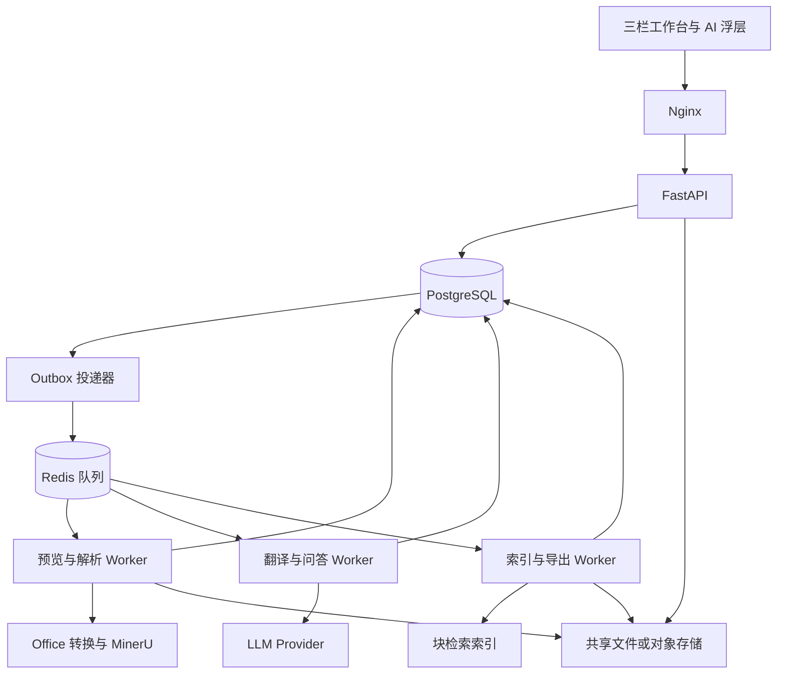
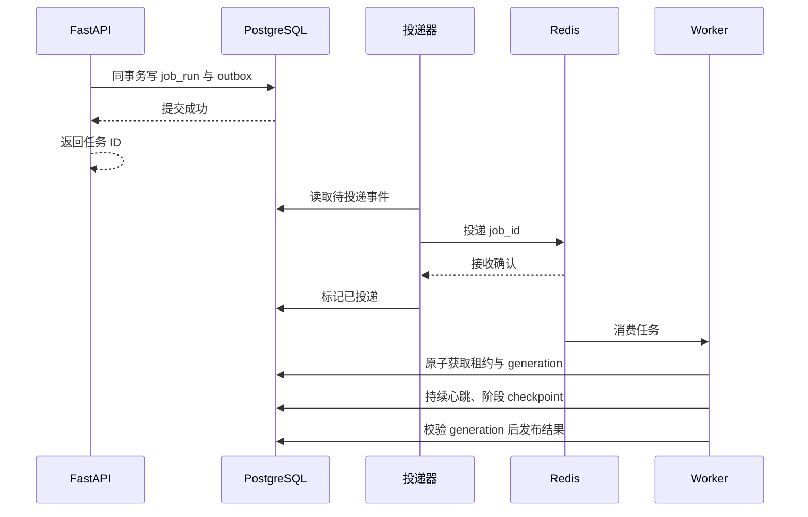
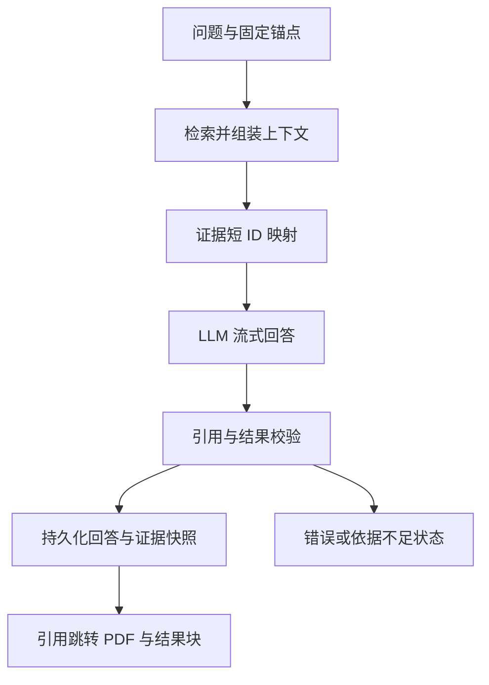

# FastAPI + MinerU 文档解析、翻译与块级解读系统完整开发方案 v2

版本日期：2026-09-05。用途：开发实现、接口协作和功能验收。

本方案整合解析、预览、翻译、区域联动、任务管理、导出和后续块级问答，替代旧版中与本方案冲突的设计。它是完整设计规格；文中的验收阈值是交付要求，不代表系统已经通过实测。

## 1. 已确认的产品形态

### 1.1 工作台

- 保留已确认的三栏布局：任务导航、PDF 原文、文档结果。
- 文档结果支持原始 Markdown、中文 Markdown、结构化 JSON，以及相应源码视图。
- PDF 与结果按块双向联动：悬浮高亮、单击定位、选中保持。
- 页面右上角设置“AI 解读”按钮，点击后向下展开覆盖式浮层；浮层不改变三栏宽度。
- 浮层内完成选中块解释、总结、比较、自由提问、相关块选择及证据引用跳转。
- 应用无需登录认证，沿用可信内网的部署方式。
- 核心业务与服务端主要使用 Python；复杂阅读器交互由 TypeScript 承担。

### 1.2 完整能力

| 能力 | 交付行为 |
|---|---|
| 文档处理 | 上传 PDF、图片、DOCX、PPTX、XLSX；建立可重现的预览与解析快照 |
| 文档解析 | 调用独立 MinerU 服务，生成原始产物及统一 DocumentIR |
| 中英翻译 | 接入本地 vLLM、SGLang 或兼容接口的外部 API；按块增量生成中文 |
| 结构保护 | 保留公式、代码、图片路径、引用、表格结构与块关联 |
| 结果纠错 | 修改译文、锁定人工结果、查看修改记录、回退历史版本 |
| 区域联动 | PDF、原文、译文、JSON 块和问答引用共享版本化定位协议 |
| 任务控制 | 查看排队和真实阶段进度、取消、按失败阶段重试、恢复中断任务 |
| 结果导出 | 原文、中文、中英对照 Markdown、DocumentIR、图片和完整 ZIP |
| AI 解读扩展 | 基于选中块及相关证据进行问答；结果可回到原文区域 |
| 运维 | 依赖检查、资源限额、指标、故障恢复、备份与引用感知清理 |

### 1.3 v2 主要修订

| 旧版缺口 | v2 的确定设计 |
|---|---|
| block_id 未充分绑定解析版本 | 所有定位采用 document_id + parse_run_id + block_id |
| 所有 bbox 使用同一除法 | 明确坐标来源、单位、裁剪区域及变换矩阵 |
| Office 解析与左侧预览无统一基准 | 建立 canonical preview，解析和预览使用相同文件快照 |
| 数据库写入后直接入队 | 事务 Outbox、任务租约、心跳及执行代次校验 |
| Worker 每次 asyncio.run 与共享连接池混用 | 固定进程事件循环，连接池与事件循环同生命周期 |
| 只校验译文结构 | 增加语义风险检查、人工修改、锁定与版本回退 |
| 单一选中状态承担全部交互 | 分离悬浮、阅读定位、问题锚点和证据浏览状态 |
| 翻译 Provider 同时承担所有 LLM 任务 | 共享传输层，拆分翻译、问答、向量化与视觉能力 |
| 引用存在即视作回答有依据 | 分开校验引用有效性与结论受到证据支持的程度 |
| 验收口径不明确 | 使用固定基准集、明确分母、故障注入及阶段对应门禁 |

## 2. 技术栈与职责边界

| 模块 | 选型 | 职责 |
|---|---|---|
| Web/API | FastAPI | 页面路由、上传会话、任务管理、资产访问、SSE |
| 模板 | Jinja2 | 初始页面和普通页面片段 |
| 普通交互 | HTMX | 上传表单、任务列表、筛选和普通操作反馈 |
| 阅读器交互 | TypeScript ES Modules | PDF.js、联动状态、懒挂载、AI 浮层与编辑 |
| PDF 预览 | PDF.js | 页面渲染、搜索、缩放、旋转、文字选择 |
| 结构渲染 | markdown-it、KaTeX、DOMPurify | 文本、公式与受控 HTML；按节点类型挂接块标识 |
| 主数据库 | PostgreSQL | 文档、版本、任务、译文修订、问答证据和持久事件 |
| 数据访问 | SQLAlchemy 2.x、Alembic | 事务、迁移和一致性约束 |
| 消息队列 | Redis、Dramatiq | 解析、翻译、导出、问答、索引和清理任务 |
| 文件存储 | 本地共享卷或 S3 兼容对象存储 | 上传原件、预览快照、解析快照、图片与导出 |
| 文档解析 | 独立 MinerU 服务 | 根据固定版本协议执行解析 |
| Office 预览转换 | 独立无界面 LibreOffice 转换服务 | 将固定 Office 输入和版面参数转换为 PDF |
| LLM | 本地推理服务或 API Provider | 提供生成、向量化或视觉能力，按配置路由 |
| 向量索引 | PostgreSQL + pgvector | 文档内、解析版本内检索，扩展阶段启用 |
| 入口 | Nginx | 反向代理、上传大小、Range、SSE 与限流 |
| 可观测性 | 结构化日志、Prometheus | 阶段延迟、排队、资源、失败与质量风险统计 |

原则：

1. Web 进程不加载 GPU 模型，不执行解析、全文翻译或大文件转换。
2. 业务代码只依赖 DocumentIR；MinerU 私有字段集中在 Adapter。
3. 原始解析快照不可变。纠错、译文、问答和导出使用各自版本。
4. 数据库是状态事实来源；Redis 是投递和通知通道，不是唯一结果存储。
5. 同一逻辑任务允许重复投递，但只允许当前执行代次发布结果。
6. 高亮在浏览器本地完成；目标未加载时，按版本获取页面或块数据。

## 3. 总体架构



图中的 Worker 类别可包含多个独立进程。翻译与问答分别消费独立队列，共享 Provider 路由和容量调度模块。

### 3.1 核心链路

| 链路 | 数据依赖 | 发布条件 |
|---|---|---|
| 上传 → 预览 → 解析 | 上传原件及冻结的转换参数 | 预览可读，DocumentIR 与资产完成校验 |
| 解析 → 翻译 | 固定 parse_run 与术语快照 | 每块结构校验完成后增量发布 |
| 解析 → 索引 | 固定 parse_run 的正文与关系 | 索引版本可用；不阻塞原文阅读 |
| 选中块 → 问答 | 固定锚点、上下文快照、Provider | 引用可解析；回答完成后记录质量状态 |
| 解析/译文 → 导出 | 固定 parse_run、translation_run、人工修订版本 | manifest、资源路径与内容摘要全部匹配 |

## 4. 文档输入、预览与解析基准

### 4.1 三种资产必须分开

| 资产 | 含义 | 是否可变 |
|---|---|---|
| original_asset | 用户上传的原始文件 | 不可变 |
| preview_asset | 供左侧阅读器显示的固定 PDF 快照 | 不可变 |
| parse_input_asset | 实际交给 MinerU 的文件 | 不可变 |

采用页面定位路线时，preview_asset 与 parse_input_asset 必须具有相同内容摘要。用户看到的页面必须就是坐标所属的页面。

### 4.2 各类输入的固定路线

| 输入 | 预览与解析策略 | 关联信息 |
|---|---|---|
| PDF | 预检通过后直接采用原件；如需修复则产生独立规范 PDF | 原件、规范文件摘要及修复记录 |
| PNG/JPEG 等图片 | 按 EXIF 方向生成固定 PDF；多图按上传顺序分页 | 原图到 PDF 页面的几何变换 |
| DOCX/PPTX | 使用独立转换进程生成 PDF，预览和 MinerU 解析均使用该 PDF | 转换器版本、字体集合版本、原件摘要 |
| XLSX | 冻结工作表范围、打印区域、方向和缩放参数后转 PDF | 工作表与输出页范围；原始单元格关联须单独建立 |

DOCX 的原生段落锚点、PPT 的对象、Excel 的单元格是另一类 SourceLocator，可在原生结构扩展中使用。原生解析文本不能直接借用转换 PDF 的 bbox；只有显式建立映射后才能显示页面级精确联动。

### 4.3 转换约束

- 转换过程不原地覆盖原件；每次转换独立工作目录和用户配置目录。
- 转换环境固定字体包、语言、时区及软件版本。缺失字体必须记录并在预览检查中显示。
- XLSX 转换参数允许用户预览确认；禁止静默把整张超宽工作表压成不可读单页。
- 转换 PDF 预检：页数、页面尺寸、可渲染性、是否为空、是否超出配置限额。
- 加密文件返回明确的可处理状态；密码如需输入仅用于当前处理，不能进入日志和产物。
- 预览准备、转换失败、解析失败分开呈现，支持从失败阶段恢复。

LibreOffice 提供 `--convert-to`、`--outdir` 和独立用户配置目录参数；转换服务将其封装为固定参数、受限子进程和独立工作目录，输出仍需执行上述预检。[LibreOffice 启动参数](https://help.libreoffice.org/latest/en-US/text/shared/guide/start_parameters.html)

## 5. 版本模型与身份协议

### 5.1 文档、运行和修订

| 概念 | 身份 | 更新规则 |
|---|---|---|
| 文档 | document_id | 每次业务上传创建独立文档；内容去重放在资产层 |
| 解析运行 | parse_run_id | 每次重新解析创建新运行 |
| 解析块 | document_id + parse_run_id + block_id | 同一解析快照内固定 |
| 翻译运行 | translation_run_id | 绑定一个 parse_run，冻结模型、术语、Prompt 和生成参数 |
| 人工译文修订 | edit_revision_id | 追加修订；回退也记录为一次新修订 |
| 问答消息 | message_id + generation_id | 重新生成创建新 generation，不覆盖历史回答 |
| 导出运行 | export_run_id | 冻结输入版本和选中修订 |

### 5.2 block_id 的生成与稳定范围

block_id 可沿用页序、阅读序和内容摘要组合，或在规范化时分配 UUID；它只承诺在同一 parse_run 内稳定。不得将短内容哈希当作跨文档全局唯一身份。

数据库唯一约束：

```text
UNIQUE(document_id, parse_run_id, block_id)
```

所有 API、缓存键、DOM 注册、问答引用、关系边和向量索引都包含 parse_run_id。坐标、文本与阅读序变动不能悄悄修改已经发布的快照。

### 5.3 当前版本切换

- documents 保存 active_parse_run_id、active_translation_run_id。
- 新解析运行完成校验后，通过条件更新切换 active_parse_run_id；失败时原版本保持可读。
- 译文只能激活在其所属解析版本上。新解析可先显示原文，并提示对应译文仍在准备。
- 浏览器打开工作台时固定版本，收到新版本事件后提示切换，不在阅读中静默替换。
- 历史问答引用解析旧快照；查看旧引用时显示版本提示及返回当前版本入口。
- 如需迁移书签或人工修订，建立 old_block_ref → new_block_ref 的匹配记录；低置信度、拆分和合并情况要求人工确认。
- 存在问答引用、锁定修订、书签或活动导出的快照不进行普通自动清理；强制清理应留下失效引用说明。

## 6. DocumentIR 与块结构

### 6.1 根对象

```json
{
  "schema_version": "2.0",
  "document_id": "doc-example",
  "parse_run_id": "parse-example",
  "preview_asset_id": "asset-example",
  "preview_sha256": "...",
  "mineru_version": "locked-version",
  "adapter_version": "2.0.0",
  "page_count": 10,
  "pages": [],
  "blocks": [],
  "relations": [],
  "assets": []
}
```

示例中的 ID 为说明性字符串；实际文档和运行 ID 使用 UUID。

### 6.2 页面与坐标元数据

| 字段 | 说明 |
|---|---|
| page_index | 从 0 开始的文件页序；接口与数据库统一采用此字段 |
| page_label | 可选印刷页标，如 iv、A-3；不作为数组索引 |
| media_box / crop_box | PDF 原始用户空间中的页面边界 |
| intrinsic_rotation | 文件固有旋转，不等同于用户在阅读器中追加的旋转 |
| user_unit | PDF 用户空间的单位倍率 |
| source_coordinate_space | 上游坐标形式与单位 |
| source_to_pdf_transform | 上游坐标到规范 PDF 用户空间的变换 |
| localization_level | region、page、element、none |

### 6.3 块字段

| 字段 | 约束 |
|---|---|
| block_id | parse_run 内唯一 |
| parent_block_id | 同版本的父块，可空 |
| block_type | heading、paragraph、list、list_item、table、table_cell、formula、code、image、caption、reference、footnote 等 |
| order_index | 同版本阅读序；合并块另存源块关系 |
| section_path | 标题路径，用于目录、上下文、检索 |
| source_nodes | 有类型的行内节点：text、math、code、link、reference、image 等 |
| source_text | 从结构派生的检索/展示文本，不能替代结构本身 |
| source_regions | 一个或多个几何区域；可跨页 |
| source_locator | PDF 区域或原生 Office 元素锚点 |
| translatable | 是否存在允许翻译的自然语言字段 |
| source_content_hash | 源结构的规范化摘要 |
| parse_warnings | 低置信度、残缺表格、缺框等质量信息 |

### 6.4 表格、图片和公式

- 表格保留行列、合并单元格、表头、脚注及单元格标识。只有表格整框时，单元格定位显示“表格区域”，不伪造单元格 bbox。
- 图片保存内部资产 ID、相对导出路径、图题、来源区域和可选 OCR 描述。
- 公式保存原始 LaTeX；如有截图则同时保留。原始 LaTeX 无法渲染时回退原文或截图，并报告异常。
- 段落跨栏或跨页时保留多个 source_regions；翻译单元与几何区域无需一对一。
- DocumentIR 是页面渲染和导出的共同输入。Markdown 是派生产物，不能通过重新切 Markdown 来猜块 ID。

## 7. 坐标适配与渲染协议

### 7.1 按来源转换

MinerU 当前官方输出说明区分 content_list 的 0～1000 坐标、VLM model.json 的 0～1 坐标以及带 page_size 的页面结构。适配必须依据已固定的版本、后端和文件类型，不得只看数字范围猜单位。[MinerU 输出格式](https://opendatalab.github.io/MinerU/reference/output_files/)

| 坐标声明 | 处理 |
|---|---|
| page_units | 使用声明的页面尺寸及原点，将坐标映射到规范 PDF 用户空间 |
| normalized_1000 | 先除以 1000，再恢复到对应上游页面空间 |
| normalized_01 | 已归一化；直接恢复到对应上游页面空间 |
| image_pixels | 使用该页实际渲染尺寸和渲染到 PDF 的变换，不能使用全文件统一 DPI 猜测 |

Adapter 使用配置和真实样本登记 coordinate_space、origin、rotation_applied、crop_applied。元数据不足时输出定位降级，不静默猜测。

### 7.2 内部统一坐标

1. 内部规范基准是 preview PDF 的未施加固有旋转的 CropBox 用户空间。
2. bbox_pdf 保存该空间内坐标；bbox_norm 保存相对 CropBox 的左上原点 0～1 坐标。
3. 上游做过旋转或裁剪时，先用 source_to_pdf_transform 还原，再规范化。
4. 变换四个角得到四边形；斜框需要 polygon_pdf，不能仅变换左上/右下两点。
5. 页面展示使用 PDF.js viewport transform，统一处理文件固有旋转和用户追加旋转。
6. Overlay 布局采用 CSS 像素。devicePixelRatio 只影响 Canvas 位图分辨率，不再次乘到覆盖框位置。

PDF.js 的 viewport 包含缩放、旋转及原点转换；官方高分屏示例也将 Canvas 像素尺寸与 CSS 尺寸分开。[PDF.js 示例](https://mozilla.github.io/pdf.js/examples/)

### 7.3 坐标校验与降级

- 转换前验证数据有限、宽高为正、页号合法；转换后校验边界和非零面积。
- 极小数值越界可按有记录的容差裁剪；大范围越界、错误坐标声明返回 ADAPTER_COORDINATE_INVALID。
- region：可精确标出区域；page：仅定位页面；element：原生结构锚点；none：无可靠定位。
- 页面显示真实定位级别，不把页级命中计入区域定位成功率。
- 保留上游原始 bbox、变换和最终 bbox，便于复现偏移。

## 8. 数据库与持久化模型

| 表 | 主要字段/约束 | 作用 |
|---|---|---|
| documents | id、client_id、original_asset_id、active_parse_run_id、active_translation_run_id | 文档目录与当前版本 |
| assets | id、sha256、storage_key、size、mime、state | 内容寻址资产；去重不合并业务文档 |
| asset_references | asset_id、owner_type、owner_id | 引用感知清理 |
| preview_runs | id、document_id、conversion_config_hash、preview_asset_id | 预览转换和参数快照 |
| parse_runs | id、document_id、preview_run_id、engine_config、mineru_task_id、status | 独立解析运行 |
| document_pages | parse_run_id、page_index、geometry | 坐标基准 |
| document_blocks | document_id、parse_run_id、block_id、source_nodes、source_regions、hash | 规范块 |
| block_relations | parse_run_id、from_block_id、to_block_id、relation、provenance | 邻接、章节、图表和引用关系 |
| translation_runs | id、parse_run_id、provider_profile_revision、prompt_hash、glossary_hash | 翻译配置冻结 |
| translation_unit_definitions | parse_run_id、block_id、unit_id、source_node_ids、source_spans、source_hash | 解析版本内不可变的翻译单元定义 |
| translation_units | run_id、block_id、unit_id、status、auto_revision_id | 引用固定单元定义的本轮翻译结果 |
| translation_revisions | id、parse_run_id、block_id、unit_id、run_id、text_nodes、origin、quality_state、created_at | 绑定固定单元定义的自动/人工修订，追加保存 |
| translation_overrides | parse_run_id、block_id、unit_id、active_revision_id、locked、lock_version | 同解析版本内人工结果优先级 |
| job_runs | id、kind、run_ref、status、generation、lease_owner、lease_expires_at | 通用任务执行与接管 |
| outbox_events | id、aggregate_id、payload、delivery_state、attempts | 事务提交后可靠投递 |
| task_events | id、document_id、run_ref、event_type、payload | 可重放任务事件 |
| export_runs | id、parse_run_id、translation_run_id、revision_manifest、asset_id | 导出冻结快照 |
| qa_sessions / qa_messages | session_id、message_id、document_id、parse_run_id、question、anchor_refs | 会话归属、问题与固定锚点 |
| qa_generations | id、message_id、context_snapshot_id、provider_profile_revision、status、answer | 同一问题的多次生成及独立终态 |
| qa_context_snapshots | generation_id、selected_units、related_units、hash、token_budget | 实际上下文证据 |
| qa_citations | generation_id、index、block_ref、unit_ids、region_indexes | 可验证引用 |
| qa_stream_chunks | generation_id、sequence、content、event_type | 合并后的流式片段与续传 |
| block_embeddings | parse_run_id、block_id、chunk_id、embedding_profile_revision、vector | 版本内语义检索 |

关键约束：

- 译文、关系、问答引用通过复合外键绑定所属 parse_run，阻止跨版本串数据。
- 同一 source_hash 可用于去重/缓存，但不能让两个 document_id 共享可变任务状态。
- 译文生成与人工修改采用乐观锁；revision 不匹配返回 409，并保留用户草稿。
- 删除采用文档删除标记、取消任务、解除引用、延迟垃圾回收的顺序。
- 最终结构状态、版本指针和 outbox 写入在同一数据库事务内完成。
- 数据库与文件没有分布式事务：先写并校验不可变资产，再在事务内登记引用与发布状态；失败资产由孤儿扫描回收。

## 9. 任务状态、可靠投递与恢复

### 9.1 状态分层

文档卡片的总状态由各运行派生，不能用一个 documents.status 锁住全部操作。

| 运行 | 状态 |
|---|---|
| 上传 | CREATED、UPLOADING、UPLOADED、INVALID、EXPIRED |
| 预览 | QUEUED、CONVERTING、VALIDATING、READY、FAILED |
| 解析 | QUEUED、SUBMITTING、SUBMIT_UNKNOWN、RUNNING、DOWNLOADING、NORMALIZING、READY、FAILED、CANCEL_REQUESTED、CANCELLED |
| 翻译 | QUEUED、RUNNING、PARTIAL、READY、FAILED、CANCEL_REQUESTED、CANCELLED |
| 单翻译单元 | PENDING、RUNNING、VALIDATED、NEEDS_REVIEW、FAILED、SKIPPED |
| 问答生成 | QUEUED、RETRIEVING、GENERATING、VALIDATING、COMPLETED、STOP_REQUESTED、STOPPED、FAILED |
| 导出 | QUEUED、BUILDING、VALIDATING、READY、FAILED |

已有可用原文不会因翻译失败而消失；索引失败不会阻止原文和译文阅读。

### 9.2 Outbox 投递



投递器在“队列接收后、标记投递前”崩溃会产生重复消息，这是允许的。Worker 的抢占和发布必须幂等，不能依赖恰好投递一次。Dramatiq 的自动重试同样要求业务 Actor 可重复执行。[Dramatiq 错误处理](https://dramatiq.io/guide.html#error-handling)

### 9.3 租约与迟到结果

- job_run 保存 lease_owner、lease_expires_at、generation、heartbeat_at。
- Worker 通过单条条件更新获取任务；心跳仅延长当前 owner/generation 的租约。
- Reconciler 周期检查过期租约，读取 checkpoint 后决定续跑、核对外部任务或重试。
- 同时扫描超过派发宽限期仍未领取的 QUEUED 任务，涵盖 Outbox 已标记投递但 Redis 消息丢失的情况；通过数据库条件更新生成补投记录。消费者仍须检查任务状态与代次，以承受补投和旧消息重复到达。
- 接管时增加 generation。所有进度、终态及资产发布更新必须带 generation 条件。
- 被替换的 Worker 即使恢复，也只能留下可清理的临时资产，不能切换当前结果。
- Worker 进程重启扫描之外，还需常驻 Reconciler，覆盖进程仍存活但任务停滞的情况。

### 9.4 MinerU 提交的不确定状态

- 调用前持久化 submission_request_id、参数摘要和 SUBMITTING 状态。
- 若上游支持幂等键或按请求 ID 查询，适配器显式启用并验证。
- 若提交超时且无法确认是否接收，进入 SUBMIT_UNKNOWN；先核对任务列表或服务记录。
- 上游不支持核对时，按配置决定人工重试或受限再次提交，并提示可能重复消耗算力。
- 不承诺外部服务绝对只执行一次；只保证业务发布不串版本且重复结果可识别。

### 9.5 取消与清理

- cancel 请求持久化取消标志；每个阶段边界、轮询和写回前检查。
- 支持上游取消时调用取消接口；不支持时停止本系统后续处理，记录外部资源可能仍在使用。
- 取消状态提交后，使用代次条件拒绝迟到结果。
- 正在生成或导出的资产先标记，待任务退出与引用释放后再清理。

## 10. Python 并发与连接生命周期

### 10.1 进程模型

- FastAPI：每个进程独立 lifespan，建立自己的 AsyncClient、AsyncEngine 和连接池。
- Dramatiq：显式启用 AsyncIO middleware，每个 Worker 进程维持固定事件循环线程，并验证启动和退出生命周期钩子。
- HTTP 客户端、AsyncEngine 在所属事件循环内创建和关闭；禁止跨进程、跨循环复用。
- 每个数据库工作单元独立 AsyncSession，不让多个并发任务共享 Session。
- Office 转换和 CPU 密集处理放独立受限子进程；避免阻塞 Web 或 LLM I/O 事件循环。
- 不采用“每个任务 asyncio.run，同时复用全局异步连接池”的组合。

SQLAlchemy 明确限制默认 AsyncEngine 连接池跨事件循环共享；因此连接池生命周期必须作为 Worker 运行契约的一部分。[SQLAlchemy 异步生命周期](https://docs.sqlalchemy.org/en/20/orm/extensions/asyncio.html#using-multiple-asyncio-event-loops)

Dramatiq 的 AsyncIO middleware 负责异步 Actor 的事件循环线程；连接资源应在该循环中初始化与关闭，不能只依据 Worker 主线程的启动时机创建。[Dramatiq AsyncIO](https://dramatiq.io/reference.html#dramatiq.middleware.AsyncIO)

### 10.2 并发限制

分别设置 Web 请求数、转换进程数、MinerU 在途任务数、翻译单元批次、问答在途数和导出数。多进程共享额度使用服务端集中容量计数；进程内 Semaphore 只约束本进程。

长时间轮询 MinerU 不应占用数据库连接或长事务。网络操作、模型请求与文件传输均在数据库事务之外执行，仅状态更新使用短事务。

## 11. MinerU 接入与解析发布

### 11.1 接口适配

MinerUClient 定义 health、submit、query、download、cancel、reconcile 六类能力；cancel 和 reconcile 用 capability 标记支持情况。具体 URL、字段、任务状态和结果格式由固定部署版本的 OpenAPI 与契约样本确定。

- 不假定所有版本都有相同 /tasks、protocol_version 或取消字段。
- 启动时记录版本，执行轻量协议检查；升级部署需通过真实契约测试。
- 保存原始返回、原始 middle/content_list 等产物，供 Adapter 回放；日志只存必要元数据。
- 轮询退避、重试和结果保留时限均来自部署配置；不显示没有依据的排队序号。
- 下载结果到 staging，执行压缩结构、资源、校验和检查，完成后发布不可变解析目录。
- 只有预览摘要一致、页数一致、块引用有效、资产存在时，parse_run 才能进入 READY。
- 缺 bbox、表格识别不完整等情况可发布带质量说明的结果；协议损坏和版本混合不得发布。

### 11.2 增量可见

解析进度来自上游真实状态；无页级进度时展示阶段和已等待时间。解析完成后立即开放原始文档结果，翻译与索引继续独立执行。

业务进度优先显示“已完成块/总块数”“准备预览”“等待推理”，而非按固定权重推算全部耗时百分比。

## 12. 结构化翻译流水线

### 12.1 翻译对象

| 对象 | 翻译行为 |
|---|---|
| 标题、正文、列表、图题、表题 | 翻译自然语言文本节点 |
| 表格 | 翻译单元格文本；表格骨架、行列和合并关系由程序保留 |
| 公式、代码 | 原样保存；自然语言解释在 AI 解读中生成 |
| 链接、图片、引用 | 目标地址与标识不可改；允许翻译可见自然语言标签 |
| 作者、机构、参考文献 | 按文档规则配置，默认保留作者与文献原文 |
| 已有中文或混合语言 | 按文本节点检测；保留不需转换的节点 |

### 12.2 最小单元与块关系

- 几何 block 是定位对象；translation_unit 是稳定的译文修订与重试对象。
- 普通段落可对应一个 unit；超长段落、长列表和表格可拆成多个 unit。
- 每个 unit 保存所属 block_ref、source_node_ids、原始顺序与 source_hash。
- 单元定义在解析版本内冻结，unit_id 绑定原始节点及字符跨度；更换 Provider、token 预算或重新翻译不能改变人工锁定的归属。
- 模型上下文不足时可将单元拆成请求 fragment，保存 fragment_id 与原始跨度，全部片段完成后合并回同一 unit 再发布。fragment 不作为独立人工修订或锁定对象。
- 如需变更单元划分算法，建立显式的新旧映射与冲突确认记录；未完成映射的人工修订仍保留在原定义上，不能静默丢失。
- 长段落优先按句子边界拆分，提供前后文只读上下文；代码与数学节点保持完整。
- 一个 unit 失败时保留同块其他成功结果；UI 显示该块的部分完成状态。

### 12.3 执行步骤

1. 固定 parse_run、目标语言、术语快照和生成配置。
2. 提取允许翻译的文本节点；冻结受保护节点和目标字段。
3. 按章节与 token 预算组批，提供文档标题、当前标题和必要邻居。
4. LLM 仅返回 unit_id 对应译文；不返回 HTML 表格骨架或最终 Markdown 文档。
5. 校验 JSON、ID 数量、保护标记计数、非空结果与 token 截断状态。
6. 执行数字、单位、否定及比较关系风险检查。
7. 校验通过的自动修订增量发布；风险结果进入 NEEDS_REVIEW 并保留源文。
8. Render/Export 从原始结构和有效译文修订重建结果。

### 12.4 保护与校验

保护优先采用结构化节点；必须进入文本模型输入的不可变片段使用唯一占位符。占位符校验使用多重集合，而非集合：

```python
Counter(input_placeholders) == Counter(output_placeholders)
```

同时要求：

- unit_id 输入输出计数一致，不能用集合比较掩盖重复 ID。
- 每个占位符必须属于当前 unit，不能跨单元借用。
- 路径、引用 ID、公式内容与代码逐项还原，HTML 标签由程序生成。
- 不要求自然语言中的标记绝对顺序相同；按节点语义判断关联，避免误伤正常语序调整。
- finish_reason 为长度截断、流中断、空 content 或结果不完整时，不作为成功译文。
- 纯公式、专有名词和代码不使用统一的“中文比例阈值”拒绝。

### 12.5 质量风险与人工确认

结构校验通过只表示结构有效，不表示语义正确。quality_state 分为 STRUCTURE_VALID、REVIEW_REQUIRED、HUMAN_CONFIRMED。

执行状态与质量状态分别存储：单元 status=NEEDS_REVIEW 时，候选修订 quality_state=REVIEW_REQUIRED；人工确认后创建 HUMAN_CONFIRMED 修订，不覆盖原始质量记录。

| 检查 | 检查方法 | 处理 |
|---|---|---|
| 漏译 | 文本节点覆盖、空串、异常长度变化 | 显示源节点与译文差异 |
| 数字与单位 | 规范化数值、百分比、量纲及相邻实体 | 标记增删或数值关系异常 |
| 否定与比较 | 检查 not/without、increase by/to 等高风险表达 | 人工复核，不能由规则宣称语义必然正确 |
| 术语 | 使用固定术语与允许变体表 | 提示不一致并支持局部重译 |
| 表格 | 文本回填位置、行列、合并关系与数据单元格摘要 | 结构错误阻止发布 |

可选第二模型复核用于产生风险提示，不用第二模型的“通过”替代人工基准验收。

### 12.6 人工修订和锁定

- 在结果块的操作菜单中提供“编辑译文、查看差异、锁定、回退”。
- 人工编辑以允许文本节点为粒度；新增自然语言不能更改原始 block_ref。
- 保存创建新的 translation_revision，使用 lock_version 防止多标签页互相覆盖。
- 有效译文优先级：人工锁定修订 > 已选择人工修订 > 当前运行自动修订 > 源文回退。
- 锁定信息绑定 parse_run 与 unit，批量重译只创建新自动结果，保留有效人工锁定结果。
- 解锁或选择自动版本后重新计算有效视图。切换修订不会删除旧内容。
- 跨解析版本不能自动沿用人工修订；通过明确映射迁移，并记录确认。
- 每次变更触发受影响块的渲染更新与导出过期标记；原始解析资产保持不变。

### 12.7 术语表和缓存

术语优先级：项目固定 > 文档人工 > 文档自动。自动提取只更新本次文档候选，不污染项目词表。

翻译缓存键包含：规范源结构摘要、相关上下文摘要、术语摘要、目标语言、Provider 配置修订、实际模型修订、Prompt 版本和生成参数。

- 临时随机占位符先规范化，不直接加入缓存键，否则同内容无法命中。
- 命中缓存后按当前 unit 重绑定 ID 并重新校验；不能沿用其他文档的块标识。
- 人工译文不自动写入跨文档全局缓存。
- 术语更新只使受影响 unit 失效；原有快照仍可查看与回滚。

### 12.8 重试

429/临时网络错误按 Retry-After 或退避重试；JSON/结构错误执行有限修复请求、拆批、单 unit 重试，耗尽后进入人工复核。

Provider 内重试和队列重试使用同一总体预算，避免两层重试相乘。认证错误、模型不存在和协议不兼容直接返回可操作错误。

## 13. 统一 LLM 接入与资源调度

### 13.1 共享与拆分

| 层 | 职责 |
|---|---|
| ProviderTransport | HTTP 连接、认证、超时、流解析、错误映射、用量统计 |
| GenerationProvider | 文本生成与流式生成，声明能力与参数约束 |
| TranslationService | 翻译 Prompt、保护、分批、校验与修订 |
| QAService | 证据组装、问答 Prompt、引用与生成记录 |
| EmbeddingProvider | 文本向量化；维护维度、模型版本及归一化规则 |
| VisionProvider | 按能力接收图片与文本；支持图像解释扩展 |

翻译和问答可以使用同一个模型实例；Embedding 和视觉处理依据实际能力配置。不能因接口兼容就假定聊天模型也支持 embeddings。vLLM 官方按生成、Embedding、评分等模型能力区分接口。[vLLM 服务能力](https://docs.vllm.ai/en/latest/serving/online_serving/)

### 13.2 Provider 配置

| 配置组 | 必要字段 |
|---|---|
| 连接 | profile_id、revision、base_url、model、secret_ref、connect_timeout、read_idle_timeout、total_deadline |
| 能力 | chat、stream、json_schema、vision、embedding、token_count、cancel |
| 模型预算 | context_limit、max_output_tokens、tokenizer_profile、reasoning_budget、safety_margin |
| 调度 | max_inflight、tokens_per_minute、request_priority、reserved_qa_slots |
| 追溯 | model_revision、prompt_version、chat_template_revision（可获得时） |
| 外部传输策略 | local_only、允许的外部 profile 列表、自动故障转移范围 |

启动探针除 /models 外，执行受控的短文本、流式和结构输出测试；不支持的能力在配置中明确禁用或走普通 JSON 校验路径。

### 13.3 响应兼容

- 区分可见 content、reasoning 字段、工具调用和 finish_reason。
- 翻译默认请求直接结果；模型必须推理时将推理 token 纳入预算。
- content=null、只有 reasoning 或只有工具调用不视作译文/回答成功。
- 网关返回 HTML 错误、429、连接断开和模型异常统一转换为业务错误，不向用户显示原始代理响应。
- 工具调用不是本系统翻译/问答的默认执行通道；检索由确定的服务端流程完成。
- 协议参数集中适配，不能在业务代码里直接依赖某一模型专有字段。

### 13.4 推理容量与取消

- 本地 MinerU 与 LLM 按部署配置分配 GPU 或使用外部推理服务，记录实际资源拓扑。
- 共享 LLM 时限制翻译在途数及单批 token，保留问答容量，并用公平调度防止翻译长期饿死。
- 独立 qa 队列不等同于 GPU 容量隔离；Web 队列与 Provider 准入都必须限额。
- 全局容量按 profile/模型实例计数；多 Web/Worker 进程不能分别放大总额度。
- local_only 文档不得因本地故障自动流转外部 API；故障转移仅在文档允许的 profile 集合内进行。
- 停止生成先持久化状态，再调用支持的上游取消或关闭流。提交停止后丢弃迟到片段。
- 无上游取消能力时说明应用已停止接收结果，不能保证推理服务同步释放算力。

## 14. 工作台与前端状态设计

### 14.1 页面职责

| 区域 | 保留功能与新增细节 |
|---|---|
| 任务侧栏 | 新建、历史、状态、收藏、失败重试；状态按运行聚合 |
| 顶部栏 | 文件、当前解析版本、翻译状态、导出和右上角 AI 解读入口 |
| PDF 工具栏 | 页码、缩放、适合宽度、旋转、搜索、定位框开关 |
| PDF 原文 | Canvas、文字层、命中层、高亮层；按页懒加载 |
| 结果区域 | 原文/中文/JSON；结构化渲染、源码、修订和局部操作 |
| AI 浮层 | 当前锚点、快捷动作、相关块、回答、提问与停止；默认收起 |

右上角 AI 浮层是非模态覆盖层；打开时仍允许操作原文。关闭不改变页面宽度，不清除问答历史，不等同于取消生成。

### 14.2 状态必须分离

```typescript
type BlockRef = {
  documentId: string;
  parseRunId: string;
  blockId: string;
};

type WorkspaceState = {
  activeParseRunId: string;
  activeTranslationRunId: string | null;
  resultView: 'source' | 'zh' | 'json';
  hoveredRef: BlockRef | null;
  readingRef: BlockRef | null;
  questionAnchorRefs: BlockRef[];
  inspectedCitationRefs: BlockRef[];
  aiOpen: boolean;
  pendingDraft: string;
  submittedContextId: string | null;
  navigationSequence: number;
};
```

| 操作 | 状态变化 |
|---|---|
| 悬浮块 | 临时 hoveredRef；不替换问题锚点 |
| 普通单击 | 更新 readingRef 并定位另一侧 |
| 加入提问/多选 | 修改 questionAnchorRefs；显示已选数量 |
| 无锚点时打开 AI | 可将当前 readingRef 作为草稿锚点；无阅读位置则提示选择 |
| 发送 | 冻结 parse_run、锚点、排除块和上下文快照 |
| 生成时改变选择 | 仅修改下一次问题草稿 |
| 查看回答引用 | 修改 inspectedCitationRefs/阅读位置，不修改已提交问题 |
| 收起浮层 | aiOpen=false，保留草稿和生成状态 |
| Esc | 优先关闭浮层；未打开浮层时清除临时阅读定位 |

### 14.3 联动与虚拟化

- 以完整 BlockRef 注册 DOM 节点和 source_regions；不同版本不得仅按 block_id 混用。
- 原文、译文和 JSON 都提供块节点注册；JSON 采用按块条目展示，不能只有不可定位的大字符串。
- 悬浮只更新可见区域；目标未挂载时显示页码/章节提示，单击再加载。
- 单击定位序列：确认版本 → 获取块与目标页 → 懒挂载 → 等待布局/公式/图片尺寸稳定 → 变换框 → 滚动。
- 每次导航带 navigationSequence，新的点击取消旧导航的后续滚动，避免慢请求把页面拉回旧目标。
- CSS 高亮标识区分临时悬浮、阅读固定和提问锚点；用文字或图标辅助，不只依赖颜色。
- text layer 保持文字选择能力。用户拖选文本时不启动块点击；命中层不能无条件吃掉全部指针事件。
- PDF Canvas 按内存预算淘汰；Markdown 按章节懒挂载；JSON 与 block 数据按需分页。
- HTMX 只替换任务栏、表单、状态等片段，不能替换 PDF.js 管理的阅读器根节点。
- 记录阅读页、块内偏移、缩放、结果 Tab 和浮层草稿；恢复时校验版本仍存在。

### 14.4 浮层中的证据定位

- 悬浮引用：显示页码和原文短摘要，左侧高亮对应区域。
- 单击引用：定位对应原文；若目标被浮层遮挡，临时收起浮层并保留“返回解读”入口。
- 从旧回答查看旧解析版本时给出明确版本提示；返回按钮恢复原来版本和阅读位置。
- 关闭、重新打开浮层不触发重复生成；按钮显示当前生成状态。
- 浮层中展示的是标题、页码、选中摘要和来源关系；内部 ID 放详情区域，避免干扰正常阅读。

## 15. 块级 AI 问答扩展

### 15.1 问答请求快照

提交时冻结以下信息：document_id、parse_run_id、anchor_refs、included_refs、excluded_refs、问题文本、会话上下文、回答模式、Provider 修订和 token 预算。

选中块不可被后台检索替换。用户显式排除的相关块不得由自动扩展再次加入。排除锚点时返回冲突提示，要求先取消锚点选择。

### 15.2 上下文预算

```text
可用输入预算 = 模型上下文上限
             - 最大输出预算（含模型需要计费/占位的推理预算）
             - 系统提示与协议开销
             - 安全余量
```

上下文优先级：强制锚点 → 人工加入块 → 显式引用关系 → 结构邻居 → 检索块 → 历史摘要。

- 预算按实际模型 tokenizer 计算；不支持精确 token 计数时使用保守估算并处理上游拒绝。
- 选中多个块本身已超预算时返回 QA_ANCHORS_TOO_LARGE，提示缩小选择或切换已配置的大上下文模型。
- 不能一边宣称“所有锚点 100% 保留”，一边静默截断选中内容。
- 超长单块可分单元执行逐段解释并明确分段结果；合成总结的引用仍保留原单元。
- 原文作为主证据；译文用于语言辅助，不能挤掉必要原文或覆盖原文含义。

### 15.3 生成与引用



- 服务端为本次证据分配 c1、c2 等短 ID，模型只引用这些 ID。
- 模型不得自造页码或资源地址；服务端从快照映射回真实 BlockRef 和 regions。
- 每段回答保存其引用集合，可定位到块内 unit；有明确文本位置时补充 source_node_ids。
- 流式输出尚未闭合的引用标记暂不生成可点击链接；完成校验后才启用跳转。
- 流式正文标记为生成中；未通过校验的引用不发布为正式证据。
- 回答无证据、出现不存在的 cID 或引用其他版本时，有限修复后失败/标记依据不足，不能偷偷删掉引用当作成功。
- 区分“文档直接说明”“根据文档推断”“通用知识补充”。默认文档证据模式；用户要求通用解释时，补充内容必须单独标记，不能挂靠无关文档引用。

### 15.4 两种引用质量

| 校验层 | 目标 | 手段 |
|---|---|---|
| 引用有效性 | 引用属于本次上下文，块/页/区域真实存在 | 程序硬校验 |
| 证据支持性 | 该段原文确实支持回答中的结论 | 标注基准与人工抽检，可辅以模型风险检查 |

“可点击”不等于“有依据”。用户能标记引用不支持结论，反馈记录绑定 generation 与证据快照，不自动修改原文。

### 15.5 图表与公式解释

- 文本模型接收公式 LaTeX、变量定义、邻近段落；表格提供表头、单位、数据及脚注。
- 只传图题时，回答显示“依据图题及正文解释”。
- 启用视觉 Provider 时传对应版本的图像裁剪、图题和必要上下文，并记录 evidence_mode=image_and_text。
- 视觉结果可能存在识别错误；读出的图表数字与结构化表格存在冲突时标记冲突，不默默选一个。
- 视觉 Provider 不可用时保留文本解释模式，并明确依据范围。

## 16. 文档内检索与相关块管理

### 16.1 结构与语义混合

| 召回来源 | 用途 | 约束 |
|---|---|---|
| 锚点与手工加入块 | 确定提问范围 | 强制包含 |
| 邻接块 | 补全上下句和指代 | 限制前后范围与总 token |
| 同章节 | 定义、方法与结论 | 同章节不意味着全部内容都相关 |
| 显式关系 | 图题、表格、公式、正文引用 | 保存关系来源和匹配可靠性 |
| 关键词/BM25 等 | 模型名、缩写、公式编号、术语精确匹配 | 保留英文技术词；中文查询需适当分词或查询改写 |
| 跨语言向量 | 中文问题召回英文原文 | 使用经过实际测试的跨语言 Embedding |

先按 document_id + parse_run_id 过滤，再召回、去重、融合排序和可选 rerank。融合可使用 RRF；权重或 reranker 参数通过固定测试集选择，不预设未经验证的“最优分数公式”。

关键词路由以 PostgreSQL 全文检索为默认实现，分词配置固定并记录；BM25 是需要另行配置后端的可替换策略，不把 PostgreSQL 默认排序宣称为 BM25。pgvector 官方也提供与 PostgreSQL 全文检索结合、使用 RRF 等方法融合的路线。[pgvector 混合检索](https://github.com/pgvector/pgvector#hybrid-search)

### 16.2 索引单元

- 索引 chunk 与定位 block 分离：一个 chunk 可含多个短块，或只覆盖长块的一部分。
- 每个 chunk 保存 source_block_refs、source_node_ids、section_path 和 embedding_profile_revision。
- 英文原文是主索引内容；标题/术语/译文可作辅助字段，不能把两种语言重复拼接到所有上下文。
- Embedding 模型、维度或归一化方式变化时建立新索引版本，不能混用不同向量空间。
- 索引未完成时问答可使用明确锚点和可用结构关系，并显示检索范围；不虚报语义检索完成。
- 问答检索结果保存实际被选入上下文的块和排除原因，便于解释“为什么关联到这一段”。

### 16.3 检索评估

建立包含中文提问、英文提问、缩写、公式编号、表格数值、跨页引用、依据不足问题的固定集。每题标注必要证据与可接受替代证据。

分别报告 Hit@K、Recall@K 及按题型的结果。K 由评估配置固定；展示块数、检索 chunk 数和真正使用的 token 预算必须区分。

## 17. FastAPI 接口契约

### 17.1 上传、预览与任务

| 方法 | 路径 | 契约 |
|---|---|---|
| POST | /api/v1/uploads | 创建上传会话，立即返回 upload_id、限制与到期时间 |
| GET | /api/v1/uploads/{upload_id} | 已接受偏移、状态、到期时间 |
| PATCH | /api/v1/uploads/{upload_id}/content | 按 Upload-Offset 顺序续传；错误偏移返回 409 |
| POST | /api/v1/uploads/{upload_id}/complete | 校验长度和摘要，完成原件持久化 |
| POST | /api/v1/documents | 引用已完成 upload_id，创建文档、预览任务和 Outbox |
| GET | /api/v1/documents | 分页查询，按 client_id 分组或按系统共享视图展示 |
| GET | /api/v1/documents/{document_id} | 当前版本、各运行状态、可操作能力与质量摘要 |
| POST | /api/v1/documents/{document_id}/preview-runs | 用固定转换参数生成新预览 |
| POST | /api/v1/documents/{document_id}/parse-runs | 指定 preview_run 创建解析任务 |
| POST | /api/v1/jobs/{job_id}/cancel | 请求取消当前逻辑运行 |
| POST | /api/v1/jobs/{job_id}/retry | 明确从可重试 checkpoint 恢复，返回 job_id 与 generation |
| DELETE | /api/v1/documents/{document_id} | 标记删除、取消任务、提交引用感知清理 |

小文件可以由上传组件封装成同一操作，但服务端仍遵循上述状态。上传耗时与任务受理耗时分开统计；不能承诺几百 MB 文件在 1 秒内完成传输。

上传会话通过写入锁/租约串行接受块，同一偏移重试需核对摘要；部分写入、断线或进程中断后，恢复到已持久提交的偏移。完成后的资产只读。

### 17.2 版本化结果与资产

| 方法 | 路径 | 契约 |
|---|---|---|
| GET | /api/v1/documents/{d}/parse-runs | 查看可用解析版本 |
| POST | /api/v1/documents/{d}/active-version | 带 expected_current_version 条件切换可用版本 |
| GET | /api/v1/documents/{d}/parse-runs/{p}/preview | 固定 PDF，支持 Range、ETag |
| GET | /api/v1/documents/{d}/parse-runs/{p}/pages | 页面几何与摘要，可分页 |
| GET | /api/v1/documents/{d}/parse-runs/{p}/blocks | 按页/章节分页或按 block_id 批量查询 |
| GET | /api/v1/documents/{d}/parse-runs/{p}/blocks/{b} | 完整块结构、定位、关系与质量状态 |
| GET | /api/v1/documents/{d}/parse-runs/{p}/document-ir | 固定版本快照 |
| GET | /api/v1/documents/{d}/assets/{asset_id} | 校验资产属于文档版本，返回文件或内部重定向 |
| GET | /api/v1/documents/{d}/parse-runs/{p}/markdown | mode=source/zh/bilingual；译文模式必须带 translation_run_id |

页面可使用 current 别名入口，但响应必须返回解析后的确切版本；后续资源请求统一使用确切版本，避免一次页面加载混入两套产物。

### 17.3 翻译与修订

| 方法 | 路径 | 契约 |
|---|---|---|
| POST | /api/v1/documents/{d}/translation-runs | 指定 parse_run、Provider、术语与目标语言 |
| GET | /api/v1/translation-runs/{t} | 状态、成功/风险/失败单元计数及使用量 |
| POST | /api/v1/translation-runs/{t}/retry-units | 显式失败单元列表或全部失败单元 |
| GET | /api/v1/translation-runs/{t}/blocks/{b} | 自动结果、有效人工修订和锁定状态 |
| PATCH | /api/v1/documents/{d}/parse-runs/{p}/blocks/{b}/translation-edit | 修改允许文本节点，带 expected_revision 与 unit_id |
| POST | /api/v1/documents/{d}/parse-runs/{p}/blocks/{b}/translation-lock | 锁定或解锁，带 expected_revision |
| GET | /api/v1/documents/{d}/parse-runs/{p}/blocks/{b}/translation-history | 修订历史及差异 |
| POST | /api/v1/documents/{d}/parse-runs/{p}/blocks/{b}/translation-restore | 选择历史修订，创建新的恢复记录 |

### 17.4 AI 解读

| 方法 | 路径 | 契约 |
|---|---|---|
| POST | /api/v1/documents/{d}/qa/sessions | 会话固定 parse_run_id |
| GET | /api/v1/documents/{d}/qa/sessions | 会话列表，显示所属解析版本 |
| GET | /api/v1/qa/sessions/{s} | 历史消息与来源版本 |
| POST | /api/v1/qa/sessions/{s}/related-blocks | 返回候选、关联原因及 token 估计 |
| POST | /api/v1/qa/sessions/{s}/messages | 提交问题与冻结锚点，返回 message_id/generation_id |
| GET | /api/v1/qa/generations/{g}/events | 可恢复流式事件 |
| POST | /api/v1/qa/generations/{g}/stop | 持久化停止，拒绝迟到片段 |
| POST | /api/v1/qa/messages/{m}/regenerate | 新 generation；默认复用原问题与证据快照，可显式选择重新检索 |
| GET | /api/v1/qa/generations/{g}/context | 实际引用和检索依据，不暴露密钥或内部系统提示 |

提问示例：

```json
{
  "parse_run_id": "parse-example",
  "question": "这一段中的距离函数解决了什么问题？",
  "anchor_refs": [{"block_id": "b12", "unit_ids": ["u1"]}],
  "included_block_ids": ["b15"],
  "excluded_block_ids": ["b21"],
  "answer_mode": "document_grounded",
  "answer_language": "zh-CN",
  "provider_profile_id": "local-qa",
  "retrieval_config_revision": "retrieval-1"
}
```

会话、URL 和请求中的 document/parse 归属必须一致，否则返回 409 或 422，不按任意一方静默覆盖。

### 17.5 幂等、错误和长任务响应

- 创建任务、提交问题、创建导出等接口支持 Idempotency-Key；作用域包含操作、文档及规范请求摘要。
- 相同键和相同参数返回原运行；相同键但不同参数返回 409。
- 长任务返回 202 和状态地址；正文只包含已持久化的事实。
- 统一错误包含 code、message、retryable、run_ref、request_id、details；details 不含密钥、内部路径或原始异常栈。

核心错误类别：

```text
UPLOAD_OFFSET_MISMATCH / UPLOAD_INCOMPLETE / UPLOAD_HASH_MISMATCH
PREVIEW_CONVERSION_FAILED / PREVIEW_FONT_WARNING
MINERU_PROTOCOL_MISMATCH / MINERU_SUBMIT_UNKNOWN / MINERU_RESULT_INVALID
ADAPTER_COORDINATE_INVALID / SOURCE_VERSION_MISMATCH
JOB_LEASE_LOST / JOB_CANCELLED
TRANSLATION_INVALID_STRUCTURE / TRANSLATION_TRUNCATED / EDIT_REVISION_CONFLICT
PROVIDER_CAPABILITY_MISSING / PROVIDER_RATE_LIMITED
QA_ANCHORS_TOO_LARGE / QA_INVALID_CITATION / QA_INSUFFICIENT_EVIDENCE
ARTIFACT_NOT_READY / ARTIFACT_EXPIRED / EXPORT_VERSION_MISMATCH
```

### 17.6 导出、任务状态与事件

| 方法与路径 | 契约 |
|---|---|
| POST /api/v1/documents/{d}/export-runs | 提交格式、parse_run_id、可选 translation_run_id；事务内冻结有效修订清单，返回 202、export_run_id 与状态地址 |
| GET /api/v1/export-runs/{e} | 返回状态、输入版本、manifest 摘要、失败原因与就绪下载地址 |
| GET /api/v1/export-runs/{e}/download | 仅 READY 可下载；支持 Range、ETag；文件名、内容与冻结 manifest 一致 |
| GET /api/v1/jobs/{job_id} | 返回持久化阶段、进度、取消状态及结果引用；不暴露内部队列载荷 |
| GET /api/v1/documents/{d}/events | 文档任务 SSE；接收 Last-Event-ID，以 run_ref 区分各次执行 |

所有跨资源路径校验 document、parse_run、translation_run、export_run 的真实归属。请求“导出当前结果”时，服务端在创建导出任务的事务内解析当前指针，此后不随页面切换而变化。失败重试创建新的执行记录，沿用冻结输入。

## 18. SSE、流式生成与事件恢复

### 18.1 事件协议

任务事件和问答事件分开。每条事件具有 stream_id、sequence、event_type、run_ref、generation、payload。

```text
id: qa-generation-example:24
event: delta
data: {"sequence":24,"generation_id":"generation-example","text":"该方法通过"}
```

### 18.2 持久化与顺序

- 事件先提交数据库再发送，断线不能造成“浏览器收到但历史丢失”。
- 同一 stream 的序列通过流状态行的事务锁或等效单写入者机制分配，保证提交顺序；不能假定全局 BIGSERIAL 的分配顺序等于事务提交顺序。
- 问答 token 按短时间窗口或字节阈值合并写入，避免每个 token 一条数据库记录。
- sequence 用于去重；Last-Event-ID 用于续传，重连不触发新的 LLM 请求。
- 状态快照带 committed_sequence；先拿快照再追事件时，从此序列继续，避免快照与订阅之间丢消息。
- 旧事件已被清理时返回需要重新获取快照的信号；用户仍可读取最终结果。

### 18.3 终态与取消

- completed、stopped、failed 通过条件更新竞争终态，只有一个最终结果。
- 停止请求提交以后，generation 的迟到 delta 不再进入持久事件流。
- 收起浮层、断开 SSE 与停止生成相互独立；刷新后恢复原 generation。
- SSE 心跳与模型 token 独立，代理关闭缓冲，读超时高于心跳周期。
- SSE 连接使用短数据库会话；不长期占用事务或 ORM Session。

## 19. 存储、导出与清理

### 19.1 存储命名空间

| 路径类别 | 内容 |
|---|---|
| uploads/{upload_id} | 可恢复上传临时块与已提交偏移 |
| assets/{sha256} | 不可变原件及规范资产 |
| documents/{d}/preview/{v} | 转换参数、字体报告、预览 manifest |
| documents/{d}/parse/{p} | 原始 MinerU 产物、DocumentIR、图片及解析 manifest |
| documents/{d}/translation/{t} | 自动翻译快照、术语、质量报告 |
| documents/{d}/qa/{g} | 可导出的回答与证据 manifest，不含密钥 |
| documents/{d}/exports/{e} | 固定输入版本的 ZIP 与 manifest |
| staging/{job_id}/{generation} | 未发布的中间文件 |

### 19.2 文件与对象存储写入

- 本地文件：同文件系统 staging 写入、必要 fsync、校验后原子 rename。
- 对象存储：上传不可变对象键，完成 multipart 并校验后发布数据库引用；不依赖目录 rename 原子性。
- 资产记录含 size、sha256、mime、storage_backend、state。未 READY 的资产不可作为正式结果下载。
- 导出生成前固定 parse_run、translation_run 和人工 revision manifest；执行中修改译文不改变当前导出内容。
- 用户修改译文后，已存在导出标记为旧修订；重新导出产生新 export_run。

### 19.3 ZIP 内容

```text
original.md
zh.md
bilingual.md
document_ir.json
translation_manifest.json
quality_report.json
manifest.json
images/
```

manifest 至少包含文档、预览、解析、翻译、人工修订、渲染器和 schema 版本，源文件摘要、实际 Provider 模型修订、所有资产摘要以及失败/回退单元清单。

- partial 翻译允许明确选择导出；未完成部分保留源文并标记状态，禁止静默省略。
- Markdown 资源使用相对路径，禁止加入临时签名 URL 或本机路径。
- 双语结果按 block/unit 对齐组织，不使用中文句长估算位置。
- 原始上传文件和 PDF 可作为可选导出项；其版本写入 manifest。

### 19.4 清理与恢复

- TTL、收藏、锁定修订、历史问答和活动导出共同决定保留状态。
- 清理按引用图执行：先标记候选、再次检查无活动租约及无引用，最后删除资产。
- 业务文档删除与资产物理去重分离；删除一个文档不能删除其他文档引用的相同资产。
- 历史版本无法继续保留时先通知或要求明确清理操作；已失效引用保留原因。
- 备份 PostgreSQL、资产、配置及必要密钥恢复材料；执行恢复演练后核对 manifest。

## 20. 部署拓扑与配置契约

### 20.1 服务清单

| 服务 | 启动职责 | 资源/持久化 | 可访问依赖 |
|---|---|---|---|
| nginx | 唯一浏览器入口 | 固定 nginx 配置、静态资源 | web |
| web | FastAPI/Uvicorn | 共享资产根目录；服务配置 | PostgreSQL、Redis、Storage |
| outbox-dispatcher | 投递未完成 outbox | 服务配置 | PostgreSQL、Redis |
| reconciler | 租约核对与故障恢复 | 同一 artifacts 或 Storage 配置 | PostgreSQL、Redis、MinerU |
| preview-worker | 预检与转换编排 | artifacts、独立临时目录 | 转换服务、数据库、队列 |
| converter | Office 转 PDF | 转换暂存目录、只读字体包 | 受限内部文件接口或共享卷 |
| parse-worker | MinerU 提交/下载/适配 | artifacts | MinerU、数据库、队列 |
| translate-worker | 单元翻译与验证 | artifacts 或对象存储配置 | Provider、数据库、队列 |
| export-worker | 固定快照导出 | artifacts | 数据库、队列 |
| qa-worker | 后续 AI 解读 | 必要资产访问 | Provider、检索、数据库、队列 |
| index-worker | 关系与向量索引 | 必要资产访问 | Embedding、数据库、队列 |
| cleanup-worker | 引用感知清理 | artifacts | 数据库、Storage |
| postgres | 业务状态与 pgvector | postgres-data | 内部网络 |
| redis | Broker、通知与容量控制 | redis-data，启用持久化 | 内部网络 |
| mineru | 接入独立模型服务，不由本项目安装包；本机模型资产见实机运行索引 | 上游管理解析输出，模型目录独立于应用 | 配置指定的服务地址 |
| llm | 按配置提供生成能力 | 模型缓存 | 内部网络、分配的 GPU |

### 20.2 实机部署合同

启动入口、指定 Python 环境与实际配置以[实机运行索引](../native.md)指向的源码为准。不使用 Docker；不直接安装 MinerU。

- 所有使用 LocalStorage 的 web、Worker、reconciler 使用同一资产根目录；不同进程不得各写互不相通的私有目录。
- 运行账户必须具有共享资产目录的有效读写权限，部署时执行跨进程读写验证。
- PostgreSQL 和 Redis 使用持久化数据目录。Redis 重建后可由数据库 Outbox/Reconciler 恢复可恢复任务。
- Nginx 加载实际配置并转发到 web 的实际端口；PDF 资产透传 Range/ETag；SSE 关闭缓冲。
- Web 和 Worker 显式注入同一数据库、Broker、存储根路径与配置修订；各服务密钥只注入确有需要的进程。
- 数据库迁移作为独立命令执行，成功后 Web/Worker 才开始受理任务；启动顺序不能替代 readiness 检查。
- 数据库、Redis、Web、MinerU、Provider 分别有健康检查；依赖恢复后应用自动重新连接。
- 启用 qa/index 能力时检查扩展迁移与 Embedding 能力；基础解析翻译不依赖向量服务 readiness。
- 固定 Python、原生服务及依赖版本；记录兼容矩阵，上游模型和 GPU 拓扑按真实服务配置登记。
- 进程停止宽限覆盖 checkpoint 和连接关闭；超时终止后的任务由租约恢复。
- 实机启动验收必须执行配置解析、服务 readiness、跨进程资产读取及重启恢复。

### 20.3 必备配置

| 类别 | 字段 |
|---|---|
| 基础 | PUBLIC_BASE_URL、DATABASE_URL、REDIS_URL、APP_REVISION |
| 存储 | STORAGE_BACKEND、STORAGE_ROOT、对象存储 endpoint/bucket/secret_ref |
| 上传 | UPLOAD_MAX_BYTES、UPLOAD_CHUNK_BYTES、UPLOAD_SESSION_TTL、DOCUMENT_MAX_PAGES |
| 转换 | CONVERTER_URL、CONVERTER_VERSION、FONT_BUNDLE_REVISION、转换并发与超时 |
| MinerU | MINERU_BASE_URL、MINERU_PROFILE_REVISION、提交/下载/轮询 deadline、结果保留时限 |
| 任务 | JOB_LEASE_SECONDS、HEARTBEAT_SECONDS、RECONCILE_INTERVAL、MAX_TOTAL_ATTEMPTS |
| 翻译 | TRANSLATION_PROFILE_ID、默认目标语言、术语版本、unit/batch token 上限 |
| 问答 | QA_PROFILE_ID、EMBEDDING_PROFILE_ID、RETRIEVAL_REVISION、上下文及输出预算 |
| 调度 | 每 Provider 在途数、翻译上限、问答保留容量、令牌速率 |
| 保留 | 默认 TTL、锁定结果保留规则、孤儿暂存宽限、事件保留窗口 |

初始超时和容量参数只作为压测起点，交付时必须记录硬件、模型、文档页数、并发和实测结果。不能把所有模型的延迟统一承诺为某个固定秒数。

### 20.4 健康检查

- /health/live：进程与事件循环存活。
- /health/ready：当前服务所需数据库、Broker 和存储可用。
- /health/dependencies：列出转换、MinerU、翻译、问答及索引能力，可用能力决定对应按钮状态。
- 就绪失败可以暂停新任务，已有结果仍应尽量可读。

## 21. 无登录模式与内容边界

- client_id 仅用于任务分组和体验恢复，不作为身份或资源隔离凭证。
- 服务面向约定的本机/可信内网环境；不增加登录页面。
- 上传检查扩展名、文件头、实际格式、大小和页数；解析子进程限制 CPU、内存、临时盘与时间。
- Provider 地址由部署配置管理，浏览器只能选择已登记 profile；密钥不发送到前端。
- 应用展示文档正文是正常功能；应禁止的是密钥、内部路径和异常栈泄露，而不是笼统禁止正文进入浏览器。
- Markdown、AI 回答和人工编辑内容使用同一受控渲染与清理策略；禁止脚本、事件属性和危险 URL。
- 图片和引用资源通过本版本资产映射解析，不能直接接受模型提供的任意 URL。
- 文档里的指令作为待解释内容，不能改变系统权限或扩大检索到其他文档。
- local_only 策略覆盖翻译、Embedding、视觉模型和问答，避免通过辅助链路绕过。
- 运行日志默认保存 ID、摘要和指标，不保存完整正文、Prompt、密钥或临时下载 URL。

## 22. 可观测性与容量管理

### 22.1 追踪字段

request_id、document_id、preview_run_id、parse_run_id、translation_run_id、job_id、generation、block_id、unit_id、provider_profile_revision、duration_ms、error_code。

### 22.2 必备指标

| 类别 | 指标 |
|---|---|
| 任务 | Outbox 待投递数、队列等待、租约接管、重复消费、SUBMIT_UNKNOWN 数 |
| 解析 | 预览耗时、解析耗时、下载失败、Adapter 不兼容、各定位等级比例 |
| 翻译 | 成功/失败/待复核单元、缓存命中、结构失败、人工锁定保留率 |
| 问答 | 排队时间、首个可见 token 时间、生成时间、证据有效率、依据不足比例 |
| 模型 | 每 profile 在途数、token 用量、429、超时、取消能力、外部调用费用（可获得时） |
| 页面 | 悬浮响应、点击到定位、页面渲染、导航取消、浏览器内存样本 |
| 存储 | 原件/解析/导出占用、孤儿资产、清理失败、备份验证结果 |

“索引完成”“译文结构校验完成”“人工确认”使用不同状态，不能用一个绿色“成功”掩盖内容质量差异。

## 23. 功能验收标准

### 23.1 基准与统计规则

准备至少 30 份固定文档：双栏数字 PDF、公式密集 PDF、复杂表格、扫描件、图片、DOCX、PPTX、XLSX，并包含长文档、混合页尺寸、旋转、非零 CropBox 和缺失字体等边界。

每份样本记录文件摘要、预览摘要、MinerU/Adapter/模型版本及人工标注。问答问题单独标注必要证据，不能由被测模型自行生成标准答案。

- 确定性约束要求全部通过；语义质量按标注口径抽检，结果保存为验收报告。
- 结构保持的参照物是已冻结的原始 DocumentIR；解析相对上传原件的识别准确性单独评价。
- 基准中缺框的块计入覆盖率分母，不能全部排除后再宣称定位准确。
- 第一次验收冻结样本、模型配置和阈值；改阈值或样本必须留下变更记录。

### 23.2 基础解析与版本验收

| ID | 操作/故障 | 必须观察到的结果 |
|---|---|---|
| DOC-01 | 上传每一种支持格式 | 原件可下载，预览可打开，解析输入摘要与预览一致 |
| DOC-02 | 中断上传后续传 | 从已确认偏移恢复；不重复拼接或丢失字节；最终摘要一致 |
| DOC-03 | XLSX 使用不同打印范围 | 每次参数形成独立快照，左侧显示对应范围，坐标匹配该预览 |
| DOC-04 | 转换缺字体/失败 | 显示具体可操作状态；失败不发布不可读预览 |
| VER-01 | 同一文档连续解析两次 | 产生不同 parse_run；原版数据仍可读取 |
| VER-02 | 旧问答引用后重新解析 | 旧引用指向原证据版本，不跳到新块 |
| VER-03 | 新版本解析失败 | 当前可读版本不被替换 |
| VER-04 | 篡改引用为其他版本块 | 归属校验失败，不返回错误版本数据 |
| VER-05 | 并发切换当前版本 | 乐观锁冲突明确返回，不静默覆盖 |

### 23.3 定位与交互验收

| ID | 操作 | 必须观察到的结果 |
|---|---|---|
| LOC-01 | 相同样本走不同已支持 MinerU 输出适配 | 坐标正确落到同一预览区域 |
| LOC-02 | 使用 50%、100%、200% 缩放与 0/90/180/270 度旋转 | 目标仍对齐，坐标变换无重复旋转或缩放 |
| LOC-03 | DPR=1/2、高分屏、非零 CropBox | Overlay 使用 CSS 像素，不出现倍数偏移 |
| LOC-04 | 跨栏/跨页段落 | 全部源区域保留，点击正确定位主区域，可访问其余区域 |
| LOC-05 | 只有整表框的单元格 | 明确提示定位到表格，不显示伪造单元格框 |
| LOC-06 | 页级/无定位块 | 展示真实等级，无异常或错页跳转 |
| UI-01 | PDF、原文、中文、JSON 间切换 | 相同完整 BlockRef 保持，定位不丢失 |
| UI-02 | 快速连续点击 20 个不同块 | 最终停在最后点击的目标，旧异步任务不能拉回页面 |
| UI-03 | 拖选 PDF 文本再复制 | 不触发块固定跳转；覆盖层不阻断文字选择 |
| UI-04 | 打开/关闭 AI 浮层 | 三栏宽度不变；无残留遮罩、滚动锁或草稿丢失 |
| UI-05 | 选 A 提问、查看证据 B | 本次问题锚点仍为 A；只改变证据浏览状态 |

坐标工程精度：以已知规范框为基准测四角投影误差，目标不超过 3 CSS px 或框短边 2% 的较大者。该指标测变换误差，不替代模型框识别质量。

端到端定位质量：在带人工区域标注的可定位文本块中，正确页且区域匹配率目标 ≥98%；匹配规则在样本清单内固定，可用同类型 bbox IoU≥0.8，跨页块逐 region 评估。另报告所有应可定位块中实际有可靠区域的覆盖率。

### 23.4 翻译与编辑验收

| ID | 操作/样本 | 必须观察到的结果 |
|---|---|---|
| TR-01 | 含公式、代码、链接、引用的文档 | 相对源 IR 的不可变节点与资源目标保持率 100% |
| TR-02 | 合并单元格与复杂表头 | 行列和合并关系保持；译文回到正确单元格 |
| TR-03 | 人工注入重复/缺失/串用占位符或 unit_id | 校验拒绝写回，不被 set 比较漏过 |
| TR-04 | 模型截断、空 content、非法 JSON | 不标记成功；有限重试后保留源文和错误状态 |
| TR-05 | 单 unit 失败 | 其他成功内容保留，能仅重试失败部分 |
| TR-06 | 同内容重试但占位符随机前缀改变 | 缓存可命中；引用重新绑定当前 unit |
| ED-01 | 人工修改并锁定，更换模型或上下文预算后重译全文 | 稳定 unit 及人工有效结果保持，请求 fragment 变化不影响锁定；自动新版可独立查看 |
| ED-02 | 两个标签页同时修改同一修订 | 后提交的过期 revision 返回冲突，草稿不丢失 |
| ED-03 | 回退某次历史修改 | 创建可追踪恢复记录；原版本仍存在 |
| ED-04 | 修改译文后下载旧/新导出 | 旧包明确是旧快照；新包内容包含新修订 |

质量评价使用人工标注句子和术语出现次数：报告漏译率、严重语义错误数、术语一致率。固定关键句集中的否定、实验结论与数字对应关系不得出现已知严重错误；术语一致率目标 ≥95%，仅统计可翻译且有指定译法的术语实例。其余抽样语义错误逐条报告，不用“中文比例”代表质量。

### 23.5 任务、流与存储故障验收

| ID | 注入位置 | 必须观察到的结果 |
|---|---|---|
| JOB-01 | DB 已提交、Redis 投递前终止进程 | Outbox 恢复投递，任务不会永远停在等待 |
| JOB-02 | 队列接收后、Outbox 标记前终止 | 重复投递不产生重复业务发布 |
| JOB-03 | MinerU 接收请求后模拟提交超时 | 进入核对流程或 SUBMIT_UNKNOWN，不直接假定失败 |
| JOB-04 | Worker 租约过期后旧进程恢复 | 只有新 generation 能发布；旧进程写回被拒绝 |
| JOB-05 | 下载/规范化中断 | 从可验证 checkpoint 恢复；半文件不以 READY 出现 |
| JOB-06 | 用户取消后上游返回成功 | 文档不被迟到结果重新激活 |
| JOB-07 | 同一进程连续并发执行异步任务 | 无跨事件循环连接池错误，连接可回收 |
| EVT-01 | SSE 断开并重连 | 从提交序列恢复，无重复生成，前端按序列去重 |
| EVT-02 | 事件保留窗口过期 | 返回快照恢复机制，最终结果仍可读取 |
| EVT-03 | 停止与完成并发 | 只存在一个终态；停止提交后无新片段写入 |
| STO-01 | 导出中修改译文 | 导出内容仍与创建时冻结的 revision manifest 一致 |
| STO-02 | 两个文档引用同一去重资产，删除一个 | 另一个文档资源不丢失 |
| STO-03 | 从备份恢复 | 文档、解析快照、人工锁定、问答引用及资产摘要一致 |
| DEP-01 | Worker 写结果、另一个 Web 进程读取 | 通过共享存储读取同一文件，不依赖进程私有路径 |
| DEP-02 | 全部服务重启与 Redis 重建 | 可恢复任务重新调度，既有产物可读 |

### 23.6 AI 解读扩展验收

| ID | 操作/样本 | 必须观察到的结果 |
|---|---|---|
| QA-01 | 提交单块/多块问题 | 接受的请求全部包含所选锚点；上下文快照可核对 |
| QA-02 | 锚点总长度超过预算 | 明确拒绝并提示调整，不静默截断 |
| QA-03 | 人工排除一个相关块 | 实际模型上下文不含该块 |
| QA-04 | 生成过程中更改页面选择 | 不改变正在生成问题的证据快照 |
| QA-05 | 模型输出不存在的引用 | 引用不激活，有限修复或失败，不伪造页码 |
| QA-06 | 关闭浮层、刷新、重新打开 | 原 generation 和历史恢复，不重复调用 LLM |
| QA-07 | 文档没有答案的对照题 | 明确说明缺少依据，不引用无关段落填补结论 |
| QA-08 | 中文问英文术语、公式编号和表格 | 在固定跨语言集上召回标注证据 |
| QA-09 | 只有图题而无视觉输入 | 明确标记依据图题；不宣称读到图内未提供的数据 |
| QA-10 | local_only 文档本地模型故障 | 不调用外部翻译、Embedding 或视觉接口 |
| QA-11 | 批量翻译同时提交问答 | Provider 预留容量生效，问答不被全部翻译请求挤占 |
| QA-12 | 回答包含文档指令文本 | 不触发外部工具或检索其他文档 |

质量统计口径：

- 引用有效率：通过引用硬校验的引用数 / 已正式发布引用数，要求 100%；无 region 的合法块允许真实页级降级，不能声称都有 bbox。
- 检索 Hit@6：至少命中一条标注必要证据的问题数 / 有答案问题数，目标 ≥80%；同时报告 Recall@6，避免只命中一条就掩盖证据不全。
- 证据支持率：人工判断受到实际引用支持的文档事实性断言数 / 回答中的文档事实性断言总数，目标 ≥95%；无引用断言计入未支持。
- 依据不足题单独统计正确拒答/明确不足的比例；固定对照集不得出现已知捏造数据或伪造来源。

### 23.7 性能与资源验收

| 范围 | 条件与指标 |
|---|---|
| 任务受理 | 上传完成且轻量校验结束后，创建业务任务目标 1 秒内；上传传输耗时单独统计 |
| 普通 API | 健康内网、明确并发和数据规模下，非文件非模型接口 P95 目标 <300 ms |
| 悬浮 | 当前数据已加载时，事件到高亮绘制 P95 目标 <100 ms |
| 点击定位 | 分开报告目标已挂载与未挂载场景，不混入模型耗时 |
| 长文档 | 100 页及更长样本按页/章节懒加载；内存受预算约束，不一次渲染全部 Canvas |
| LLM | 分开统计排队、首个可见 token、生成、校验；按实际模型/硬件建立基线 |
| 并发 | 至少测试连续 20 个任务及读写并行，无丢任务、串结果和租约失控 |

所有性能报告附机器、浏览器、GPU/显存、模型、上下文长度、文档集、冷/热缓存和并发配置。未指定硬件时不承诺统一全文翻译耗时。

## 24. 分阶段实施与阶段门禁

各阶段按依赖推进，不设置无依据的工期。AI 解读作为后续扩展，但基础版本、坐标和接口从阶段 A 起采用兼容它的协议。

| 阶段 | 完成内容 | 阶段门禁 |
|---|---|---|
| A：协议与样本 | 版本模型、DocumentIR、坐标描述、Provider 协议、基准集 | 固定样本与适配契约；BlockRef 贯穿全部设计；已验证支持输入与定位等级 |
| B：文档与预览 | 上传续传、Office/图片规范预览、资产摘要与版本 | DOC-01～04 的上传与预览项；输入快照不可变，预览与待解析输入严格一致 |
| C：解析与可靠任务 | Outbox、租约、MinerU 适配、checkpoint、发布 | DOC 全部、VER-01～05、JOB-01～07；原始产物可读；重复投递和迟到结果可控 |
| D：阅读工作台 | PDF.js、结构渲染、坐标转换、懒挂载、状态分离 | LOC-01～06、UI-01～03；三栏页面符合已确认设计 |
| E：翻译与人工修订 | Provider、节点翻译、术语、缓存、风险检查、锁定和回退 | TR-01～06、ED-01～04；结构校验和语义评估分别通过 |
| F：导出与部署验收 | 快照导出、SSE 恢复、清理、实机启动、备份与指标 | EVT/STO/DEP 全部用例及第 23.2～23.5、23.7 的基础功能适用项；不要求后续 QA 用例提前完成 |
| G：AI 解读扩展 | 右上角按钮/浮层、混合检索、问题快照、流式回答和引用 | UI-04～05、QA-01～12、第 23.6 全部扩展标准；复测基础阅读和翻译无回归 |

视觉图表理解可作为 G 的能力分支逐项启用；启用前完成 VisionProvider 与 QA-09 的证据范围验收。文本解释在任何情况下都显示其实际证据范围。

## 25. 项目结构与模块边界

| 目录 | 内容 |
|---|---|
| app/api | uploads、documents、versions、blocks、translations、edits、qa、events、exports、health |
| app/pages / app/templates | 首页、任务页、三栏工作台与普通片段 |
| app/domain | 文档版本、BlockRef、任务状态、修订、引用及值对象 |
| app/models / app/repositories | 数据表、条件更新、事务、查询与乐观锁 |
| app/document_ir | schema、MinerU adapters、coordinate spaces、relations、validators |
| app/preview | PDF 预检、Office 转换、图片规范化、字体与打印配置 |
| app/jobs | Outbox、dispatcher、leases、reconciler、取消与 checkpoint |
| app/providers | transport、generation、embedding、vision、capabilities、scheduler |
| app/translation | units、protector、glossary、orchestrator、quality、revisions、cache |
| app/qa | context builder、retrieval、evidence mapping、generation、citation validation |
| app/storage / app/export | local/object storage、manifest、快照导出、GC |
| app/workers | preview、parse、translate、qa、index、export、cleanup 与进程生命周期 |
| frontend/state | 工作台状态、版本注册、事件去重与草稿恢复 |
| frontend/pdf | viewer、cache、transform、hit testing、selection、overlay |
| frontend/results | IR renderer、Markdown/JSON view、block registry、revision editor |
| frontend/linking | hover、navigate、anchor selection、citation inspection |
| frontend/ai | 右上角入口、浮层、证据选择、流式结果与停止 |
| migrations | 核心迁移与 QA/向量扩展迁移 |
| deploy | 实机启动、Nginx、配置模板、字体/模型版本锁定、备份恢复 |
| tests | 协议 fixture、单元、故障注入、真实 Provider 契约、E2E、质量评估 |

跨模块调用使用完整 BlockRef 和运行快照，禁止服务通过“当前版本”隐式查询后替换调用者指定版本。

## 26. 最终交付清单

1. Python 应用、TypeScript 工作台、模板与构建产物。
2. DocumentIR 2.0 schema、坐标声明、API OpenAPI、SSE 事件协议及迁移脚本。
3. 经过真实样本验证的 MinerU Adapter 与版本兼容清单。
4. 预览转换服务、冻结字体/打印参数和输入格式样本。
5. 翻译 Provider 配置、Prompt/术语版本、质量报告和人工修订流程。
6. Outbox、租约、恢复、取消、SSE 续传与资产清理实现。
7. 固定版本导出包、manifest、完整资源校验和历史版本读取。
8. 可运行的实机启动入口、Nginx、共享存储、健康检查、备份与恢复操作说明。
9. 第 23 节用例对应的验收结果、失败样本、实际硬件及性能报告。
10. 后续阶段 G 的右上角 AI 解读、检索配置、证据快照和引用验收报告。

交互 HTML 继续作为页面行为参考；生产交付以真实文档、真实解析/LLM 接口和上述验收结果为准。

## 27. 参考与适用说明

以下官方资料用于约束外部组件行为；本文中的版本模型、任务策略、UI 状态、数据表和验收协议是本项目的设计决策。部署时固定实际依赖版本并执行契约验证，不以在线最新文档代替运行环境的真实协议。

- [MinerU 输出格式](https://opendatalab.github.io/MinerU/reference/output_files/)：不同输出的块结构、页索引和坐标形式。
- [MinerU 使用说明](https://opendatalab.github.io/MinerU/usage/quick_usage/)：服务与解析入口；最终以固定版本 OpenAPI 为准。
- [PDF.js 示例](https://mozilla.github.io/pdf.js/examples/)：viewport、旋转和高分屏 Canvas 渲染。
- [Dramatiq 用户指南](https://dramatiq.io/guide.html)：自动重试与幂等执行假设。
- [Dramatiq AsyncIO](https://dramatiq.io/reference.html#dramatiq.middleware.AsyncIO)：异步 Actor 的事件循环线程。
- [pgvector 混合检索](https://github.com/pgvector/pgvector#hybrid-search)：向量与全文检索结合、结果融合。
- [SQLAlchemy asyncio](https://docs.sqlalchemy.org/en/20/orm/extensions/asyncio.html)：Session 并发使用和连接池生命周期。
- [vLLM 在线服务](https://docs.vllm.ai/en/latest/serving/online_serving/)：生成、向量化及其他模型能力对应的接口。
- [FastAPI 官方文档](https://fastapi.tiangolo.com/)：API、生命周期与文件请求处理。
