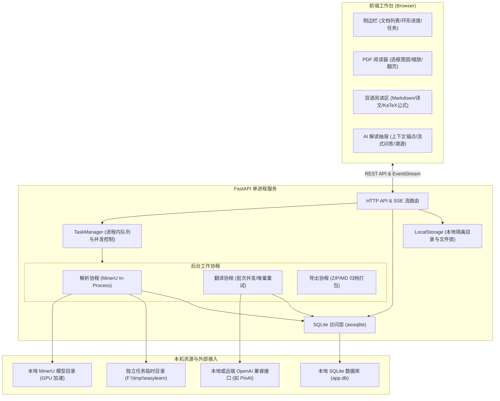

# FastAPI + MinerU 轻量完整开发方案 v3

> 本文档基于当前 EasyLearn 实际工程代码整理，作为系统架构、领域模型与实现规范的单一技术规格说明。所有具体实现均遵循单一真相源（SSOT）原则，直接指向源文件。

---

## 1. 系统定位与设计边界

EasyLearn 是面向研究者与专业用户的文档智能解析、中英对照翻译与沉浸式阅读工作台。系统坚持**长期主义与极简架构**，避免过度设计与外部中间件依赖：

| 维度 | 架构选型与确定行为 | 代码真相源 |
|---|---|---|
| **服务模型** | 单进程 Uvicorn + FastAPI，无需 Docker、Nginx 或外部多进程编排 | [main.py](../../src/easylearn/main.py) |
| **持久化存储** | 本地嵌入式 SQLite (`aiosqlite`)，无独立数据库服务 | [database.py](../../src/easylearn/database.py) |
| **异步任务管理** | 进程内 `TaskManager` + `asyncio.Queue` + 信号量，无需 Redis 或 Celery | [tasks.py](../../src/easylearn/tasks.py) |
| **解析引擎** | 嵌入式 MinerU Python API，直连本地 GPU 权重目录，无额外解析微服务 | [parser.py](../../src/easylearn/parser.py), [embedded.py](../../src/easylearn/mineru/embedded.py) |
| **翻译引擎** | 单元级切分、批次即时落库、断点续传、系统代理探测与指数退避重试 | [translation.py](../../src/easylearn/translation.py) |
| **公式排版** | 本地内置 KaTeX (v0.16.11) 运行库，零外部网络依赖，100% 离线居中渲染 | [static/katex/](../../src/easylearn/static/katex/) |
| **前端交互** | 原生 HTML5 / CSS3 / ES Modules，无 Node 构建或打包步骤 | [index.html](../../src/easylearn/templates/index.html), [app.js](../../src/easylearn/static/app.js) |

---

## 2. 总体架构与数据链路



---

## 3. 核心子系统设计与实现索引

### 3.1 文档解析与 DocumentIR 体系
- **实现模块**：[`src/easylearn/parser.py`](../../src/easylearn/parser.py)、[`src/easylearn/mineru/embedded.py`](../../src/easylearn/mineru/embedded.py)、[`src/easylearn/document_ir/schema.py`](../../src/easylearn/document_ir/schema.py)。
- **模型与路径配置**：模型候选采用强类型静态枚举与配置文件显式登记（[`config.toml [mineru.models]`](../../src/easylearn/config.py)），支持将解析计算与任务临时空间置于高速盘路径（如 `F:\tmp\easylearn`）。
- **流程与生命周期**：
  1. 上传文件经 [`validate_input`](../../src/easylearn/filetypes.py) 校验 Magic MIME；
  2. PDF 预检获得几何尺寸与指纹（[`PdfPreflight`](../../src/easylearn/previews/pdf.py)）；
  3. 调用嵌入式 MinerU 执行管道提取文本块、标题、公式、表格与插图；
  4. 归一化生成符合标准几何坐标系的 `DocumentIR` 并存入 SQLite 与文件系统；
  5. 若任务设置了 `auto_translate: true`，成功后自动编排并流转至翻译队列。

### 3.2 批量翻译引擎（增量落库与断点续传）
- **实现模块**：[`src/easylearn/translation.py`](../../src/easylearn/translation.py)。
- **切分协议**：按结构化语义单元切分（`p{page}.b{block}.c{chunk}:l{line}.s{span}` 与 `b{block}:n{node}`），严格保护占位符 `{{...}}`、公式与链接。
- **高韧性保障机制**：
  1. **批次级即时落库（Batch Incremental Persistence）**：按批（默认 20 个单元）向大模型发起结构化 JSON 请求，每一批成功即刻调用 `publish_batch` 写入 SQLite，中途故障已译部分永不丢失；
  2. **断点续传（Breakpoint Resume）**：重新提交或重试任务时，自动检测库中已有 `auto_text` 的单元直接复用并跳过，仅将未完成单元分批发送；接口提供 `force: bool` 用于手动强制全篇覆译；
  3. **智能代理与指数退避重试**：优先探测系统注册表代理（`urllib.request.getproxies()`）与显式 `[llm] proxy` 配置，对底层断流（`httpx.TransportError` / HTTP 429/5xx）实行指数退避多轮重试，并在最终抛出时保留真实根因；
  4. **批次内增量补漏（Incremental Repair）**：针对大模型偶发漏回 ID 或边缘带有空白的情况，实施 `strip()` 清洗并以递增退避仅对缺失单元发起补漏请求；
  5. **URL 标点剥离正则**：收敛 URL 匹配至标准 ASCII 集合并智能剔除中英文尾随标点，彻底消除 `Protected tokens changed` 误报。

### 3.3 AI 解读与结构化问答
- **实现模块**：[`src/easylearn/qa.py`](../../src/easylearn/qa.py)。
- **证据冻结机制**：提问时锁定所选段落及上下文证据块，严格限制大模型仅基于证据回答，并在回答中以 `[1]`、`[2]` 规范标注文献证据索引。
- **流式交付与跳转**：
  - 后端通过 `AsyncClient.stream` 实时将生成的 Markdown 流式推送到前端；
  - 任务完成后落库生成 `qa_records`；
  - 前端渲染交互式引用药丸，点击药丸瞬间平滑定位并闪烁高亮原文与译文卡片。

### 3.4 人工修订与锁定防覆盖
- **实现模块**：[`src/easylearn/source_edits.py`](../../src/easylearn/source_edits.py)、[`src/easylearn/translation.py`](../../src/easylearn/translation.py)。
- **修订机制**：
  - 支持对 OCR 识别错误的源文本进行就地修订，修订记录附带递增 `revision` 版本号；
  - 支持用户对机器翻译文本进行编辑，保存为 `manual_text` 并激活 `use_manual = 1`；
  - 支持对重要段落设置 `locked = 1`，后续全文重新翻译或自动批处理时，已锁定的人工译文坚决不被静默覆盖。

### 3.5 多格式导出服务
- **实现模块**：[`src/easylearn/exports.py`](../../src/easylearn/exports.py)、[`src/easylearn/rendering.py`](../../src/easylearn/rendering.py)。
- **导出规格**：
  - 原文 Markdown 与 中文 Markdown；
  - 中英双语对照排版；
  - 结构化数据 `document.json` 与图片资源；
  - 统一压缩归档的 ZIP 格式分发。

---

## 4. 前端工作台交互体系与设计规范

前端采用现代化语义设计，消除过度框架依赖，所有资产（含离线字体与 KaTeX）本地化分发：

### 4.1 三栏式自适应布局
- **实现代码**：[`src/easylearn/templates/index.html`](../../src/easylearn/templates/index.html)、[`src/easylearn/static/app.css`](../../src/easylearn/static/app.css)。
- **窗口自适应**：设置 `html, body { height: 100%; overflow: hidden; margin: 0; }`，根除浏览器最右侧全局多余滚动条，全应用高度 100% 贴合视口；
- **自适应三栏**：
  1. **左侧栏（232px）**：文档树、SVG 环形进度条、圆形文件徽标与统一操作按钮；
  2. **中栏（PDF 阅读器，1.15fr）**：浮动操作条（翻页/缩放/适宽/旋转/选框开关）、自适应缩放画布与几何选框图层；
  3. **右栏（双语结果面板，0.95fr）**：Markdown、中文译文、JSON 与源码，独立内部平滑滚动。

### 4.2 侧边栏任务与进度感知
- **环形 SVG 进度条**：外圈包裹高分辨率 SVG 环（`r=15.5`，`stroke-width=2.2`），结合 `stroke-dashoffset` 动画精确呈现 `上传中 XX%`、`解析中 XX%`，排队中呈现旋转动效，完成呈现翡翠绿对勾；
- **文件类型徽标**：区分 PDF（红）、PPT（橙）、DOCX（蓝）、XLSX（绿）、图片（蓝灰）等矢量圆形标牌；
- **统一交互按钮**：统一使用 26x26px 现代化矢量 SVG 图标按钮，配备 Tooltip 提示，并从文档卡片移除易混淆的取消按钮，统一在任务面板处理。

### 4.3 KaTeX 离线数学排版与色彩规范
- **离线集成**：本地部署 [`src/easylearn/static/katex/`](../../src/easylearn/static/katex/)（CSS、ES 模块与 WOFF2 字体，零 CDN 依赖）；
- **排版模式**：段落内公式自动识别渲染；块级公式（`formula` / `equation`）启用 `displayMode: true` 居中排版；
- **色彩与状态规范**：
  - **常态（未选中/未悬浮）**：继承普通文本块外观，背景完全透明、无边框、无角标，不打扰阅读连续性；
  - **悬浮与选中态**：激活专属洋红/粉红色系（`border-color: #f43f5e; background: #fff1f2;`），并显示粉红“公式”角标；
  - **双向平滑联动**：点击左侧选框，右侧结果容器精确定位居中并触发 `targetFlash` 平滑聚焦闪烁动效。

### 4.4 右上角 AI 解读抽屉
- **设计形态**：位于右上角的滑出式抽屉（Drawer），不挤压正文阅读三栏；
- **交互组件**：
  1. **上下文锚点框**：动态绑定当前选中的段落/公式块，支持点击快速跳转定位；
  2. **快捷提示词药丸**：提供“解释核心概念”、“公式推导说明”、“总结段落主旨”等一键触发；
  3. **流式打字面板**：支持逐字渲染与自动滚屏；
  4. **交互式引用溯源**：解析回答中的 `[1]`、`[2]` 标注文献，点击瞬时高亮原文与译文证据。

---

## 5. 配置、启动与部署接口

### 5.1 依赖安装与启动
```bash
# 激活 learn 环境并安装依赖
python -m pip install -e ".[dev]"

# 启动服务（支持通过 .env 注入 PINAI_API_KEY）
python -m easylearn --config config.toml
```

### 5.2 配置真相源 (`config.toml`)
详细字段定义由 [`src/easylearn/config.py`](../../src/easylearn/config.py) 保证强类型校验：
```toml
[app]
host = "127.0.0.1"
port = 8765
data_dir = "data"

[mineru]
models = [
  { model_id = "mineru2.5-1.2b", path = "F:\\models\\MinerU2.5-Pro-2605-1.2B" }
]
default_model = "mineru2.5-1.2b"
task_dir = "F:\\tmp\\easylearn"

[llm]
base_url = "https://api.pinaic.com/v1"
model = "gemini-2.5-flash"
api_key_env = "PINAI_API_KEY"
local_only = false
proxy = "http://127.0.0.1:7890"  # 可选：显式指定本地代理端口
max_retries = 3
```

---

## 6. 自动化验证与质量防线

项目实行严谨的 TDD 开发与验证体系，所有改动均经过多级自动化保护：

1. **协议与领域单测**：[`tests/v3/`](../../tests/v3/)
   - 覆盖配置加载、SQLite 事务、MinerU Catalog、DocumentIR 序列化、翻译批次断点续传、增量补漏、网络代理与 KaTeX 静态资源路由；
   - 验证标准：94 个单元测试全绿（执行耗时约 12-14s）。
2. **端到端浏览器验收**：[`tests/browser/`](../../tests/browser/)
   - 基于无头 Chrome 与 Selenium，执行真实 PDF 上传、GPU 解析管线推进、DOM 缩放与双向联动测试；
   - 验证标准：包括真实复杂论文（26页+）的全链路自动化验收全部通过。
