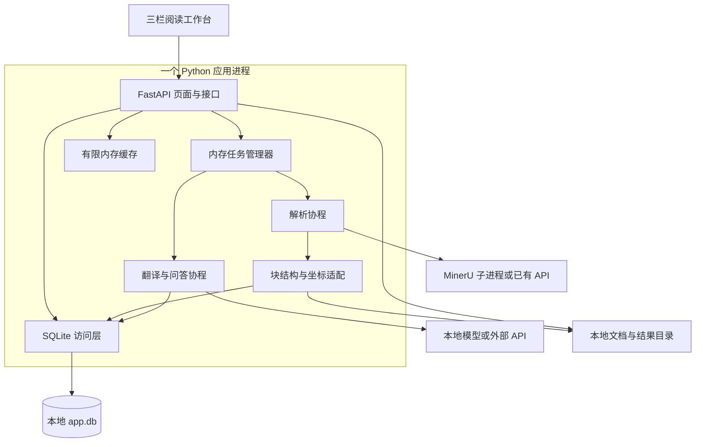

# FastAPI + MinerU 轻量完整开发方案 v3

适用场景：个人或小团队内部使用的文档解析、翻译与阅读工作台。

本版依据已确认的需求重新设计：单个 FastAPI 服务进程、SQLite、本地文件、内存队列和有限内存缓存。任务失败后手动重新执行；程序重启后不恢复未完成任务。三栏页面及右上角 AI 解读入口保持不变。

本文是一份独立的终版开发规格，替代 v2 中的部署、存储、任务调度与恢复设计。阶段划分只表示实现依赖，不包含工期估算。验收项是开发完成后的检查要求，不代表已经实现或实测。

## 1. 产品能力与设计边界

| 能力 | 确定行为 |
|---|---|
| 页面 | 左侧任务导航、中间 PDF 原文、右侧解析与翻译结果 |
| 文档解析 | PDF、图片；Office 输入通过可选转换组件获得固定 PDF 预览后解析 |
| 结果阅读 | 原始 Markdown、中文 Markdown、结构化 JSON、源码视图 |
| 中英翻译 | 本地 vLLM / SGLang 或外部兼容 API，支持全文与选定块翻译 |
| 区域联动 | 原文与结果双向悬浮高亮、单击定位、多块选择 |
| 人工处理 | 修改译文、锁定、查看近期修订、恢复某次修订 |
| 任务 | 排队、真实阶段进度、取消、失败后手动重做 |
| 持久保存 | 已完成解析、已完成译文、人工修订、已完成问答和上传原件 |
| 导出 | 原文、中文、中英对照 Markdown、JSON、图片与 ZIP |
| 后续扩展 | 选中块提问、相关块关联、引用定位；从右上角按钮展开浮层 |
| 使用方式 | 无登录认证；安装 Python 依赖后，通过统一入口启动 |

应用不要求 PostgreSQL、Redis、Dramatiq、对象存储、向量数据库、Nginx 或 Docker。已有 MinerU 和 LLM 服务可以直接接入；模型权重、GPU 运行环境仍由相应解析/推理环境提供。

## 2. 上一版设计过重的点

### 2.1 删除或替换

| v2 设计 | 为什么对本项目偏重 | v3 处理 | 接受的限制 |
|---|---|---|---|
| PostgreSQL 独立数据库 | 文档目录和修订记录不需要独立数据库服务 | SQLite 文件 + aiosqlite | 以单机、小规模并发读写为部署边界 |
| Redis 任务与缓存服务 | 为短期队列和缓存增加安装、端口及运维 | asyncio.Queue、字典和有容量限制的 LRU | 未完成任务随程序退出而消失 |
| Dramatiq Worker 体系 | 独立进程、队列和生命周期管理多于实际需要 | FastAPI 进程内的固定数量后台协程 | 不做跨机器任务调度 |
| 事务 Outbox | 用户不要求提交后任务必达或故障后补投 | 内存接收成功即进入排队；进程退出后用户重做 | 不承诺任务跨重启保留 |
| 租约、心跳、执行代次和接管 | 面向多个 Worker 竞争和失效接管 | 同一文档互斥执行、任务独立临时目录、取消标记 | 不自动接管卡住的任务；超时后失败 |
| checkpoint、断点续跑、恢复扫描 | 用户已接受失败后重新执行 | 删除；重试创建新任务，从该操作起点执行 | 失败前本次临时成果不继续使用 |
| 数据库任务表、Outbox 表、事件表 | 状态仅需覆盖当前运行周期 | 内存任务字典；日志记录近期错误 | 重启后不保留完整任务执行历史 |
| 持久化 SSE、逐段流记录与重放序列 | 为流式显示引入完整事件存储协议 | 任务进度轮询；问答使用直接流，断线后查当前状态 | 不重放历史 token；不自动重新生成 |
| S3、资产目录表、跨文档去重、通用引用计数 | 本地文件足够，去重后删除关系反而复杂 | 每份文档独立目录，不做跨文档物理去重 | 重复上传可能多占一份存储 |
| pgvector、向量检索服务和复杂索引版本管理 | 问答检索限定当前文档，数据范围小 | 结构关系 + 关键词；需要时增加 NumPy 文档内向量检索 | 超大文档需限制索引加载量，不做全库检索 |
| 多层 Provider 框架、动态路由与容量调度 | 两类生成业务不需要插件平台 | 一个 LLMClient，翻译与问答各写自己的业务函数 | 固定配置切换，不做自动跨服务故障转移 |
| 自动多级重试、模型降级与修复链 | 增加结果不确定性和失败定位难度 | 默认失败即返回错误；用户手动重做 | 瞬时服务错误也可能需要用户再点一次 |
| 全量、永久保存的版本与修订体系 | 普通使用不需要无限历史 | 保留最近 2 个成功解析版本，以及问答仍引用的版本；修订历史限制数量 | 过期且无引用的历史可以被清理 |
| HTMX + TypeScript 构建链 + 模板共同管理交互 | 小工作台可用普通 JS 模块完成，混用增加维护成本 | Jinja2 + 原生 JavaScript ES Modules | 大型前端团队协作能力不作为目标 |
| Compose、Nginx、多进程 Uvicorn | 与直接 Python 启动的要求不一致 | 单进程 Uvicorn，Python 入口自动初始化 | 不提供多节点高可用 |
| 独立 Office 转换服务 | 转换不需要额外常驻服务 | 按需启动受限转换子进程 | 启用 Office 时仍需安装转换器和字体 |
| Prometheus 及全面监控部署 | 为小工具增加运维服务 | 轮转日志、任务页、简单健康检查 | 不提供集中监控平台 |
| 完整迁移框架和通用 Repository 平台 | 初始表少，可直接维护 SQL | 小型 db.py，按 PRAGMA user_version 执行顺序迁移 | 迁移支持范围由实际已发布版本决定 |

### 2.2 保留的必要设计

以下内容影响用户数据或定位正确性，与分布式规模无关，继续保留：

| 设计 | 最小实现 | 保留原因 |
|---|---|---|
| 原文与块关联 | document_id + parse_id + block_id | 避免重新解析后旧引用跳到错误段落 |
| 坐标转换 | 一个 MinerUAdapter + 一个前端坐标模块 | 不同坐标单位、缩放和旋转必须正确处理 |
| 结构化翻译 | 只翻译可变文本节点，程序重建结构 | 保护公式、链接、图片和表格 |
| 有效结果发布 | 临时成果校验完成后切换数据库指针 | 失败不能破坏已有成功结果 |
| 人工修订保护 | 版本号检查、锁定标记、近期修订记录 | 重译和多标签页操作不能静默覆盖人工工作 |
| 并发与容量上限 | 少量后台协程、Semaphore、有界队列 | 防止挤满 GPU、内存和模型请求 |
| AI 问题锚点 | 每次提交复制选中块与相关块列表 | 查看引用不能改变原问题 |
| 内容安全渲染 | 转义、HTML 清洗、文件路径限制 | 文档内容进入网页后仍需正确处理 |

这里的“版本”只是成功结果的编号和目录，不引入分支合并、跨版本自动迁移或任务恢复。

## 3. 总体架构



一个 Web 服务进程负责应用状态。MinerU、Office 转换属于耗时外部程序，按需作为子进程运行；已有解析服务可以替代本机子进程。LLM 通过 HTTP 调用，不把大模型加载进 Web 进程。

### 3.1 技术选型

| 层 | 选型 |
|---|---|
| Python | 3.11 或以上；发布时固定并验证支持版本 |
| Web | FastAPI、Uvicorn、Jinja2、python-multipart |
| 数据库 | SQLite + aiosqlite；普通 SQL |
| HTTP | httpx.AsyncClient，共享连接池 |
| 任务 | asyncio.Queue、Task、Semaphore |
| 配置 | config.toml，Python tomllib 读取；密钥通过环境变量 |
| 实例限制 | 数据目录上的本机文件锁，例如 filelock |
| 前端 | 普通 JavaScript 模块、CSS、PDF.js、markdown-it、KaTeX、DOMPurify |
| 文件处理 | Python 标准库；图片转换可用 Pillow |
| 可选检索 | NumPy；Embedding 调用独立配置的兼容服务 |

前端依赖的浏览器发行文件随安装包提供，无需用户启动前端开发服务器或联网加载 CDN。开发者按模块维护 JS；不要求 Node 构建环境才能运行产品。

## 4. 安装、配置与启动

以下命令是待实现程序的交付接口，不表示当前已经提供可运行的完整服务源码：

```bash
python -m pip install -r requirements.txt
python -m documind --config config.toml
```

启动过程：

1. 读取配置并锁定 data_dir，阻止第二个实例同时使用同一目录。
2. 创建数据库和文件目录；首次运行自动建表，旧数据库按已支持的版本顺序升级。
3. 在 FastAPI lifespan 中建立数据库连接、HTTP 客户端、内存队列和后台协程。
4. 检查配置的 MinerU 命令或服务地址；检查可选组件的可用性。
5. 以单个 Uvicorn Worker 启动，输出本地页面地址。

生产启动固定 workers=1。开发模式的 reload 会结束当前进程内任务，页面应按服务重启处理。FastAPI 官方提供 lifespan 管理共享资源的初始化与关闭。[FastAPI 生命周期](https://fastapi.tiangolo.com/advanced/events/)

### 4.1 最小配置示例

```toml
[app]
host = "127.0.0.1"
port = 8765
data_dir = "./data"
open_browser = true

[tasks]
queue_limit = 8
parse_concurrency = 1
translation_requests = 1
qa_requests = 1
finished_task_retention_minutes = 30

[cache]
max_mb = 128
max_documents = 3

[mineru]
mode = "cli"
command = ["mineru"]
timeout_seconds = 900

[llm]
base_url = "http://127.0.0.1:8000/v1"
model = "your-served-model-name"
api_key_env = "DOCUMIND_LLM_API_KEY"
timeout_seconds = 600
local_only = true

[files]
max_upload_mb = 100
keep_parse_versions = 2
revision_history_limit = 10

[extensions]
office_enabled = false
qa_enabled = false
semantic_search_enabled = false
```

模型名填写推理服务实际提供的名称。上述队列、缓存和超时数值是可调整的起始配置，不是性能保证。外部 API 需要显式修改服务地址和 local_only 配置。

核心功能安装完成即可使用 PDF/图片解析与翻译。Office、问答和语义检索是独立能力开关；对应能力按第 14 节实现后启用，不影响应用基础启动。

### 4.2 MinerU 的两种接入方式

| 模式 | 使用方式 | 取舍 |
|---|---|---|
| 本机 CLI | 应用启动任务时调用配置好的 mineru 命令，传入输入和独立输出目录 | 无需用户单独管理 MinerU 常驻服务；可能有每次启动/模型加载成本 |
| 已有 API | 调用本机或远端已有 MinerU 服务 | 复用已加载模型；服务地址和实际协议需要配置 |

CLI 使用参数数组调用 `asyncio.create_subprocess_exec`，不拼接 shell 命令；支持配置 Windows 的 mineru.exe 路径，或其他 Python 环境中的可执行文件。

MinerU 官方提供 `mineru -p <input> -o <output>` 入口。当前官方文档说明 CLI 可管理临时本地 API，也可连接已有服务，因此适配器需要按固定版本处理进程树和输出，不假定所有版本的内部启动过程相同。[MinerU 使用说明](https://opendatalab.github.io/MinerU/usage/quick_usage/)

任务完成后把所需产物复制进本应用文档目录。应用不能长期依赖 MinerU API 自身的临时结果目录。已有 API 模式只负责当前进程存活期间的请求、状态查询和结果获取，不在应用重启后追踪旧任务。

## 5. 数据放在哪里

### 5.1 三类存储

| 位置 | 内容 | 重启后 |
|---|---|---|
| SQLite | 文档目录、成功解析版本、有效译文、人工修订、完成问答 | 保留 |
| 本地文件 | 上传原件、规范预览、解析 JSON、图片、导出 | 保留 |
| 内存 | 任务队列、当前任务状态、取消标记、实时进度、热点文档 | 清空；不自动重建任务 |

数据库不保存“正在执行”“排队中”等临时任务状态。文档有没有可用结果，由已发布结果记录决定；启动时不扫描数据库恢复任务。

### 5.2 文件组织

| 路径 | 内容 |
|---|---|
| data/app.db | SQLite 数据库 |
| data/documents/{document_id}/original/ | 上传原件 |
| data/documents/{document_id}/parses/{parse_id}/ | 成功解析的 preview.pdf、document.json、原始 MinerU 结果、图片 |
| data/documents/{document_id}/exports/{export_id}/ | 已完成导出包及导出清单 |
| data/documents/{document_id}/search/{parse_id}/ | 可选向量与块映射文件 |
| data/tmp/{task_id}/ | 当前任务的临时转换、解析或导出结果 |
| data/logs/ | 有大小和数量上限的轮转日志 |

每个文档独立保存，避免跨文档去重后的引用计数。tmp 不属于已完成结果，失败后不用于续跑。已结束任务立即清理自己的临时目录；启动时可删除超过宽限期的遗留目录，但不能在可能仍有外部子进程写入时直接复用或删除。

数据库放本机磁盘。备份使用 SQLite backup API，或完整停止应用后复制数据库和文档目录；运行中不只复制 app.db 而忽略 WAL。[Python SQLite](https://docs.python.org/3/library/sqlite3.html)

### 5.3 最小数据库表

| 表 | 关键字段 | 说明 |
|---|---|---|
| documents | id、name、original_path、active_parse_id、favorite、created_at | 文档列表与当前成功结果 |
| parse_results | id、document_id、preview_path、ir_path、created_at | 只登记已经校验完成的解析结果 |
| translations | parse_id、block_id、unit_id、auto_text、manual_text、use_manual、locked、revision | 当前有效译文；主键为前三个字段 |
| translation_history | id、parse_id、block_id、unit_id、text、origin、created_at | 有数量上限的修订与恢复记录 |
| qa_records | id、document_id、parse_id、question、answer、context_json、citations_json、created_at | 扩展启用后，保存已完成问答 |

原始块、几何区域、表格结构和块关系保存在 document.json，不为每一种元素建表。导出文件使用独立 manifest.json，不增加 export_runs 等任务表。配置保存在 TOML，不增加通用 Provider 配置平台。

### 5.4 SQLite 访问约定

- 使用一个 aiosqlite 连接和一个应用内数据库锁。仓库函数持锁完成一整个短事务；读取也通过该访问层，避免其他协程插入未完成事务。
- 开启外键、合理 busy_timeout；可以启用 WAL 改善读取与提交的配合。
- HTTP 请求、模型推理、文件转换均在数据库事务之外执行。
- 前端编辑提交 revision；与当前值不同返回 409，保留用户草稿。
- 数据库结构升级用少量有序 SQL 脚本和 user_version 管理，失败时回滚，不自动删除用户数据。

aiosqlite 提供异步接口，并使用连接所属的工作线程执行 SQLite 操作；应用仍需自己约束事务边界。SQLite WAL 支持读写并行，但同一时间仍只有一个写入者。[aiosqlite](https://aiosqlite.omnilib.dev/en/stable/)、[SQLite WAL](https://www.sqlite.org/wal.html)

## 6. 任务：失败后重新执行

### 6.1 内存对象

每个任务只需：task_id、server_boot_id、document_id、kind、scope、status、progress、message、cancel_requested、created_at、finished_at、result_ref。

status 只使用：queued、running、succeeded、failed、cancelled。scope 表示全文或明确的块列表；不是断点信息。

TaskManager 持有有界队列、当前任务字典和按文档的互斥状态。终态任务在配置的时间后从内存移除；错误详情写入轮转日志，不依赖任务历史数据库。

### 6.2 执行规则

1. 检查队列容量和文档占用状态。满队列返回 429；同一文档已有冲突操作时返回 409。
2. 创建 task_id，将当前任务放入内存队列，接口返回 202。
3. 后台协程取出任务，执行所请求的完整操作；进度更新内存对象。
4. 结果校验成功后发布到文件和 SQLite，随后标记 succeeded。
5. 失败则标记 failed，保留原来已完成的结果，展示可操作错误。
6. 用户点击重试，创建新任务、新临时目录，从该操作的起点重新执行。

队列使用非阻塞接收或有限等待，避免上传请求无限等待空位。asyncio.Queue 本身属于当前事件循环内的队列，不用于多个线程直接共同操作。[Python asyncio.Queue](https://docs.python.org/3/library/asyncio-queue.html)

### 6.3 失败、重试和重启的明确行为

| 情况 | 行为 |
|---|---|
| 解析失败 | 用户重试后重新解析本次输入 |
| 全文翻译失败 | 用户重试后重新翻译全文；使用已有成功解析结果 |
| 选定块翻译失败 | 用户重试后重新翻译本次选定的全部块 |
| 问答失败 | 保留当前页面问题草稿，用户手动重新提问 |
| 程序退出或异常重启 | 未完成任务丢弃，不补投、不续跑、不重连上游任务 |
| 已经完成的解析或译文 | 正常保留并可再次打开 |
| 浏览器刷新，服务仍运行 | 查询内存中的当前任务状态；不重新发起任务 |
| 浏览器刷新，服务已重启 | server_boot_id 变化后结束旧的等待界面，显示“上次处理已结束，请重新执行” |

启动时生成新的 server_boot_id。任务查询同时核对启动 ID 和任务 ID；旧任务或过期任务返回 410。单独的文档接口返回当前成功成果，前端不能因为旧任务 ID 不存在就认为已有成果丢失。

不启用跨任务断点复用、不重用失败翻译的部分结果。保留已完成的“解析”供独立“翻译”使用，属于正常业务依赖，不属于任务恢复。

### 6.4 并发与取消

- 默认一次解析、一次翻译请求；后续问答可独立允许一次请求。具体并发由 GPU 和模型服务容量配置。
- 同一文档的重新解析与翻译不能同时执行。用户重解析时先结束当前冲突操作；不同文档可以按各队列配额执行。
- 取消排队任务时标记 cancelled，消费者取到后跳过。
- 取消执行任务时设置 cancel_requested，停止后续步骤；在实际资源退出或请求结束后释放占用。
- 外部服务支持取消则调用；不支持时停止等待和结果发布，并明确可能仍在消耗上游算力。
- 本机子进程按进程树终止并等待退出；Windows 和 Linux 分别验证清理方式，不能只杀最外层进程。
- 发布前检查取消状态和文档仍然存在。同一任务专用输出目录使迟到文件不会覆盖其他任务。
- 不使用租约、心跳或任务接管。超时直接失败，由用户决定重新执行。

### 6.5 简单进度机制

任务进度采用每 1 秒轮询 GET /api/tasks/{task_id}。没有可靠总量的解析阶段显示阶段文字或不定进度，不从日志猜“完成 85%”。

翻译可显示完成单元数 / 总单元数，并将本次候选译文作为临时预览。整个请求范围成功前，候选不是正式保存结果；失败时显示错误并回到上一份有效结果。

后续 AI 解读使用流式输出。断线后可查询仍在内存中的回答全文和状态；服务重启后未完成回答丢弃。没有持久事件表、Last-Event-ID 重放或自动重新调用 LLM。

## 7. 文档解析与结果发布

### 7.1 输入与预览

- 上传成功后发起解析；用户可勾选“解析完成后自动翻译”。两步是当前进程中的顺序调用，解析成果独立保存。翻译排队失败时保留解析结果并提示手动翻译；程序重启后不继续这条调用链。
- PDF：验证可读性后作为预览和解析的共同输入；需要修复时产生独立规范 PDF。
- 图片：按 EXIF 方向转为固定 PDF 页面，解析与左侧阅读器使用同一个 PDF。
- Office：启用转换组件后，通过 LibreOffice 等固定转换器生成 PDF，再交给 MinerU。转换器和字体需要安装，但不作为额外常驻服务。
- XLSX：允许选择工作表及打印范围；转换后能预览，避免将超宽内容静默缩成不可读单页。
- 上传采用普通流式上传，不实现分片续传。中断后重新上传；临时文件不得作为正式原件出现。

“同一个文件”通过 preview_sha256 绑定。不能拿 Office 原生解析得到的无几何段落，直接配上另一份 PDF 的坐标。

### 7.2 成功结果如何替换

1. 在 data/tmp/{task_id} 中生成规范预览、解析结果和图片。
2. Adapter 检查页号、块 ID、坐标形式、结构与资产是否有效。
3. 结果写入新的 parses/{parse_id} 目录；写入失败就保留旧版本。
4. 使用短数据库事务登记 parse_results 并切换 active_parse_id。
5. 新版本成为当前结果，相关内存缓存失效。

文件和数据库没有共同事务，因此采用“先准备新文件，后切换数据库指针”的顺序。进程在两者之间退出，最多产生未引用目录，不会把半成品变成当前结果；这些目录可在空闲时清理，无需恢复原任务。

翻译以相同原则处理：当前请求范围全部通过校验后，在一个数据库事务中更新对应的自动译文。人工修订按第 9 节处理。

### 7.3 保留多少历史

- 默认保留当前及前一个成功解析版本，供查看与简单切换。
- 已完成问答引用的旧 parse_id 继续保留，直到相应问答被删除。
- 清理通过读取 parse_results、qa_records 和当前内存中的使用状态完成，不引入通用资产引用系统。
- 正在阅读、生成或导出的版本延迟清理；前端访问已清理版本时显示明确状态。
- 解析版本间不自动迁移人工译文，避免相似文本匹配错误。原修订仍留在其所属的已保留版本中。

## 8. 块结构与双向定位

### 8.1 最小 DocumentIR

```json
{
  "schema_version": "3.0",
  "document_id": "doc_example",
  "parse_id": "parse_example",
  "preview_sha256": "example_digest",
  "pages": [
    {"page_index": 0, "width": 595, "height": 842, "rotation": 0}
  ],
  "blocks": [
    {
      "block_id": "b002",
      "type": "paragraph",
      "order": 2,
      "section_path": ["Abstract"],
      "nodes": [{"node_id": "n1", "type": "text", "text": "Example source text."}],
      "regions": [{"page_index": 0, "bbox_pdf": [60, 610, 530, 735]}],
      "related_block_ids": ["b003"]
    }
  ]
}
```

示例 ID 为说明字符串，正式运行由程序生成。页号从 0 开始，页面展示时加 1。实际 pages 还保留 CropBox、MediaBox、UserUnit 和必要变换；bbox_pdf 采用该预览 PDF 未旋转的 PDF 用户空间，不把示例坐标误认为左上原点坐标。

BlockRef 固定为 document_id + parse_id + block_id，贯穿 DOM、翻译、问答引用和缓存。段落、标题、图题、表格、公式、代码分别保留类型，不靠重新切分 Markdown 猜测块归属。

### 8.2 坐标转换

1. Adapter 按已验证的 MinerU 输出协议识别坐标单位、原点、是否已经旋转或裁剪。
2. 对 0～1000 归一化坐标先除以 1000；对 0～1 坐标不重复归一化；像素坐标使用对应页面尺寸与真实变换。
3. 统一转换到预览 PDF 用户空间，保留源坐标及变换用于定位排查。
4. 前端使用 PDF.js viewport 转换四个角，处理文件固有旋转与用户旋转。
5. 覆盖框使用 CSS 像素，devicePixelRatio 只作用于 Canvas 位图分辨率。

不同 MinerU 输出可能使用不同坐标形式，必须以版本和输出类型选择适配，不根据数值大小猜测。[MinerU 输出格式](https://opendatalab.github.io/MinerU/reference/output_files/)。PDF.js 官方示例展示了 viewport 与高分屏 Canvas 的尺寸处理。[PDF.js 示例](https://mozilla.github.io/pdf.js/examples/)

跨页或跨栏块保存多个 regions。只有整表框时定位到整表；没有可信框时降级到页面并明确提示，不能画一个看起来精确的假框。

### 8.3 前端状态

只维护一个轻量状态对象，字段分工明确：

| 字段 | 作用 |
|---|---|
| hoverBlock | 鼠标暂时悬浮的块，移开清除 |
| selectedBlocks | 用户固定选择，可多选 |
| activeParseId | 当前正在阅读的解析版本 |
| questionContext | 本次提交时冻结的锚点和相关块 |
| evidenceBlock | 当前查看的回答引用，不能写回 questionContext |

悬浮只同步高亮，避免不断滚动。单击才定位并滚动另一侧；多选使用勾选框或 Ctrl / Command。文字拖选、复制不触发定位。连续点击以最后一次目标为准；页面异步加载完成后先检查目标是否仍然有效。

PDF 页面和长结果只挂载当前可见范围及邻近内容，避免一次渲染数百页。懒挂载属于阅读性能设计，不依赖 Redis 或复杂前端框架。

## 9. 翻译、编辑与锁定

### 9.1 翻译处理

1. 冻结 parse_id、请求范围、模型配置、术语表及提示词。
2. 从 DocumentIR 提取自然语言节点。按 block_id + unit_id 标识段落片段或单元格。
3. 按段落或单元格组批；长文本按句子拆分，并记录原节点位置。单元划分在当前 parse_id 内固定。
4. 给模型提供标题、术语和少量相邻上下文，要求返回 unit_id 到译文的结构化结果。
5. 校验 ID 数量、文本非空、输出是否截断，以及公式、路径、代码和引用是否保持。
6. 请求范围全部通过结构校验后，统一发布；失败则结束本次任务，用户手动重新执行该范围。

LLMClient 只负责 HTTP、请求参数、流解析与错误映射；translate.py 和 qa.py 分别组织自己的提示词和数据，不把翻译、检索、视觉、路由拆成一套插件框架。

JSON 模式或结构化输出只在所配置服务确实支持时使用。兼容聊天接口不代表模型支持 Embedding 或视觉；后两者单独配置。

### 9.2 结构保护与质量

- 表格骨架、行列、合并关系由程序保留，只翻译允许变化的单元格文本。
- 数学、代码、链接目标、图片路径、引用 ID 不交给模型自由改写。
- 必须使用占位符时，以 Counter 比较数量，防止重复标记被集合比较掩盖。
- 公式渲染失败时显示原 LaTeX；不静默省略。
- 对数字、单位、术语和异常长度变化做简单检查，产生可见的复核提示。
- 结构正确不等于语义正确；不添加多模型投票或复杂自动修复链。用户可以直接编辑或再次翻译。

### 9.3 人工结果的优先级

translations 保存当前自动候选、人工文本、use_manual、locked 和 revision：

| 操作 | 有效结果 |
|---|---|
| 尚未人工修改 | 当前成功自动译文；没有译文时回退源文 |
| 保存人工修改 | use_manual=true，显示人工文本；可同时锁定 |
| 锁定后重新翻译 | 更新自动候选，继续显示人工译文 |
| 解锁 | 只解除保护，当前人工译文仍显示 |
| 解锁后再成功重译 | 可切换到新自动译文，原人工文本仍在近期历史中 |
| 选择“使用自动译文” | 显式取消人工优先及锁定，切换到当前自动候选 |
| 恢复历史修订 | 创建新的人工修订，不原地改写历史 |

翻译执行期间新提交的人工编辑必须保留：发布时读取最新 revision 和锁定状态；与开始时不同则保留人工有效结果，并提示存在新自动候选。失败的模型请求不能改变人工锁定状态。

每个单元默认保留最近 10 次修订，当前有效修订必须保留。近期历史是本地编辑能力，不扩展为审计平台。

### 9.4 缓存

- 已发布译文直接读 SQLite，不必额外建立跨文档模型响应缓存。
- 内存缓存主要保存最近文档的 IR、派生阅读结构和可选检索矩阵。
- 缓存键包含 document_id、parse_id；译文派生视图还包含 revision 或在编辑后显式失效。
- 同时限制文档数和估计字节数，按 LRU 淘汰；超大文档按页/块读取或拒绝整体缓存。
- PDF、图片、完整上传内容不常驻 Python 内存；通过文件访问与浏览器自己的资源缓存读取。

## 10. 后续扩展：右上角 AI 解读

### 10.1 交互保持

右上角“AI 解读”按钮展开浮层，不增加第四栏，不改变原文与结果栏宽度。浮层内包含问题锚点、相关内容、快捷问题、自由输入、回答和引用。

选中块后点击“使用当前选择”创建新的提问范围。提交时复制完整 BlockRef 列表；之后点击别的块或浏览引用只影响阅读状态。浮层关闭不自动取消正在进行的请求，停止按钮显式取消。

### 10.2 相关块的简单实现

按以下顺序收集，限定当前文档与当前 parse_id：

1. 用户选中的块：必须包含。
2. 用户手动加入的块：必须包含。
3. 图题、表格说明、公式定义等显式关系。
4. 相邻段落和同节内容。
5. 关键词匹配出的候选块。

用户可以取消自动关联块。总上下文先保证选中与手工加入的内容，再按预算加入其他候选。必需块已经超出预算时明确提示缩小范围，不静默删掉某个选中块。

若需要改善中文问题对英文原文的召回，再启用跨语言 Embedding：按文档保存归一化向量和块映射，用 NumPy 点积取 Top-K。模型标识、维度和 parse_id 不匹配时重新建立索引。只加载当前正在使用的少量文档，不引入向量数据库或全库 RAG。

### 10.3 回答与引用

- 提供结构化证据列表，每个证据具有应用生成的引用编号和 BlockRef。
- LLM 输出引用编号，应用校验编号存在且属于本次证据范围，再生成可点击引用。
- 引用点击定位真实原文区域；只有页码或整表区域时显示对应的真实精度。
- 找不到依据时明确说明不足；引用能点击不代表结论受到证据支持，需人工样本检查。
- 只传图题时标记依据图题；只有配置了视觉能力并实际发送图像后，才显示图像解读。
- 文档中的提示指令作为内容处理，不执行外部工具或访问其他文档。
- 成功完成后，将问题、答案、实际证据快照和引用一起保存到 qa_records。失败或进程退出的部分回答不作为已完成历史。

历史引用仍绑定原 parse_id；重新解析后不能跳到新结果中的同名 block_id。

## 11. 页面与接口

### 11.1 页面区域

| 区域 | 功能 |
|---|---|
| 左侧导航 | 当前文档、历史文档、收藏、当前运行周期的任务列表 |
| 顶部文件栏 | 文件名、当前版本、执行状态、AI 解读、导出 |
| 中间原文 | 翻页、缩放、旋转、文字选择、区域定位、已保留版本切换 |
| 右侧结果 | 中英与 JSON 切换、源码、查找、译文编辑、锁定和近期修订 |
| 右上角浮层 | 问题锚点、相关块、解读回答、引用定位 |
| 错误提示 | 错误原因、重试按钮；明确重试将重新执行哪些内容 |

现有 HTML 和示例图继续作为三栏外观与块交互参考。生产界面的任务页不展示断点恢复或跨重启续跑；版本列表只展示实际保留的数据，模型设置与任务状态来自本版后端。

### 11.2 核心接口

| 接口 | 作用 |
|---|---|
| GET /api/health | 返回 server_boot_id、组件可用性和基本状态 |
| POST /api/documents | 上传原件并创建文档；不承诺上传续传 |
| GET /api/documents | 列表、收藏和当前成功结果 |
| GET /api/documents/{id} | 文档详情、已保留解析版本、当前内存任务 |
| POST /api/documents/{id}/parse | 新建解析任务 |
| POST /api/documents/{id}/translate | 新建全文或选定块翻译任务，固定 parse_id |
| GET /api/tasks/{task_id} | 当前进程内的状态与进度 |
| POST /api/tasks/{task_id}/cancel | 请求取消 |
| GET /api/documents/{id}/parses/{parse_id} | 对应版本的 DocumentIR，支持页/块范围读取 |
| GET /api/documents/{id}/files/{file_id} | 原件、预览、图片或导出；file_id 映射由服务端控制 |
| PATCH /api/documents/{id}/translations/{unit_id} | 提交 parse_id、block_id、revision、人工文本和锁定操作 |
| GET /api/documents/{id}/translations/{unit_id}/history | 读取同一 parse_id 与 block_id 下的近期修订 |
| POST /api/documents/{id}/exports | 固定当前解析和有效译文快照，生成导出任务 |
| POST /api/documents/{id}/qa | 扩展：固定块范围并创建问答任务 |
| GET /api/tasks/{task_id}/answer-stream | 扩展：订阅当前回答流；断线后查任务对象中的累计全文 |
| GET /api/documents/{id}/qa | 扩展：读取已完成问答 |
| DELETE /api/documents/{id}/qa/{qa_id} | 扩展：删除问答；对应旧解析版本可在无其他使用时清理 |
| DELETE /api/documents/{id} | 结束相关任务、关闭使用状态后删除文档与结果 |

重试不需要独立恢复接口：重新提交 parse、translate、exports 或 qa 请求即可。前端按钮防止连点，服务端仍检查同文档互斥，不能只依靠按钮禁用。

接口错误统一返回 code、message、request_id；必要时带当前结果引用。常用状态：409 冲突、410 任务或历史已失效、413 文件过大、422 参数错误、429 队列已满。

## 12. 导出、删除与基本运行维护

### 12.1 导出

导出开始时读取并冻结 parse_id 和有效译文，后续编辑不改变正在生成的包。小范围文本快照可放内存，较大快照写入本任务临时文件，不保存恢复检查点。

ZIP 包含原文 Markdown、中文 Markdown、可选中英对照、document.json、图片和 manifest.json。manifest 标记文档、解析版本、所用修订和生成时间，方便确认文件对应哪次结果。

导出成功后再提供下载地址；失败重做导出。原文、公式、表格、图片在页面与导出之间使用同一份 IR 和渲染规则。

### 12.2 删除与目录清理

- 删除文档前停止该文档相关任务，等待本机读写退出；上游请求无法取消时拒绝其后续发布。
- 不跨文档共享文件，因此删除只涉及该文档目录和关联数据库行。
- 自动清理过期导出、已结束任务的临时文件和未被使用的旧解析版本。
- 不在应用退出时删除成功结果，也不通过清理机制尝试重新执行失败任务。

### 12.3 必要维护

- 日志按大小轮转，记录操作、document_id、task_id、耗时与错误摘要，不记录 API 密钥。
- 提供磁盘空间不足、数据库不可写、MinerU 不可用、模型超时等可理解错误。
- 无登录模式用于可信环境；前端拿不到服务端密钥，文档 HTML 仍需清洗。
- 外部地址和可执行命令来自可信配置，不允许文档内容或普通上传字段随意指定。
- 上传名只用于展示，磁盘路径由服务器生成；下载与 ZIP 解压需要限制路径，避免目录越界。
- local_only 启用时，翻译、问答和可选 Embedding 都不得自动转发外部服务。

## 13. 功能验收标准

采用实际要处理的文档建立小型固定样本集，至少覆盖文本 PDF、扫描页、双栏、旋转页、表格、公式和跨页内容；启用 Office 后增加对应样本。以下测试不包含任务恢复要求。

| ID | 操作 | 通过条件 |
|---|---|---|
| A01 | 在干净数据目录启动 | 自动建目录和数据库；不要求启动 PostgreSQL、Redis、Nginx 或 Docker |
| A02 | 两个实例使用同一 data_dir | 第二个明确拒绝启动，不出现两个内存调度器同时管理同一目录 |
| A03 | 重启应用 | 成功结果、人工译文、锁定与完成问答仍可读；没有任务自动继续 |
| A04 | 处理中强制结束应用后重新打开页面 | 旧任务等待界面结束，明确提示重新执行；已有成功结果不丢失 |
| T01 | 队列达到配置容量，再提交任务 | 返回队列已满提示，页面不无限挂起 |
| T02 | 同一文档重复点解析或翻译 | 只接收一个冲突操作，其他请求明确返回冲突 |
| T03 | 注入解析或翻译失败，再手动重试 | 创建新任务并重新执行对应完整范围，不从失败位置续跑 |
| T04 | 翻译失败 | 已完成解析仍可读，重试翻译不会重新解析 PDF |
| T05 | 取消后上游迟到返回 | 不发布该结果，不改变原有有效成果；本机进程和占用正确释放 |
| T06 | 请求完整结果发布前中断 | 半文件、部分翻译不作为成功结果；旧结果仍可打开 |
| P01 | 解析 PDF / 图片以及已启用 Office 格式 | 预览与实际解析输入对应同一份规范 PDF，资产齐全 |
| P02 | XLSX 范围、字体或转换异常 | 显示明确状态，用户可确认预览范围，不发布不可读结果 |
| L01 | 两边逐块悬浮 | 同一 BlockRef 同时高亮，移开只清除悬浮状态 |
| L02 | 点击与多选、拖选复制混合操作 | 单击定位、多选保留；复制文本不触发错误跳转 |
| L03 | 50% / 100% / 200% 缩放与四种旋转 | 已知框的投影误差不超过 3 CSS px；无重复 DPR 缩放 |
| L04 | 跨页块、整表框和缺框 | 显示真实覆盖区域或定位等级，不伪造单元格或区域坐标 |
| L05 | 快速连续点击多个目标 | 最终停留在最后点击目标，旧异步加载不能把页面拉回 |
| F01 | 含公式、代码、链接和表格的翻译 | 相对解析 IR，受保护内容与表格结构保持，译文回到正确节点 |
| F02 | 模型截断、重复 ID、重复/缺少占位符 | 判定失败或要求复核，不作为完整成功译文发布 |
| F03 | 编辑并锁定后重译 | 人工有效文本和锁定保持，新自动候选可供选择 |
| F04 | 翻译执行中提交人工编辑，或两标签页同时编辑 | 新人工编辑不被旧模型请求覆盖；过期 revision 返回冲突且草稿保留 |
| F05 | 恢复近期修订、再导出 | 恢复创建新记录；导出采用实际有效修订 |
| E01 | 导出中修改译文 | 下载包对应导出开始时的快照，manifest 一致 |
| E02 | 逐一检查 ZIP 中资源链接 | Markdown、JSON、图片和公式可用，无缺失路径 |
| C01 | 连续打开超出配置数量的文档 | LRU 按容量淘汰，Python 内存不因保留所有历史文档持续增长 |
| C02 | 修改译文后切换页面和重新打开 | 页面与导出均显示新有效结果，不命中旧译文缓存 |
| Q01 | 提交问题后选择其他块，再查看引用 | 已提交问题的锚点与证据范围保持；引用只改变阅读位置 |
| Q02 | 打开与关闭 AI 浮层 | 三栏宽度不变，草稿保持，关闭不默认重新生成 |
| Q03 | 排除相关块，或必需块超出上下文预算 | 排除内容不发送；预算不足时明确拒绝，不静默遗漏选中块 |
| Q04 | 重新解析后点击历史回答引用 | 打开实际被引用的 parse_id 和原区域；旧版本仍被正确保留 |
| Q05 | 虚构引用编号或文档无答案的问题 | 不激活无效引用；缺少依据时明确说明，不能伪造页码或数据 |
| Q06 | 流中断、停止或应用重启 | 不自动发起第二次模型请求；完成答案可读，未完成请求按失败/取消处理 |
| Q07 | local_only 启用，模拟本地模型故障 | 不调用外部翻译、Embedding 或视觉服务 |

L03 测坐标转换，不把模型识别框本身的误差算成前端变换错误。原始框识别质量单独按样本人工核对并记录缺框、错页、区域偏移。

翻译语义人工检查固定样本中的数字、单位、否定、比较关系和术语，发现明确错误后修正提示词或人工修订；不以“中文比例高”或“结构通过”代替语义质量。

运行体验检查使用实际目标电脑和文档：模型执行时页面仍可操作，已挂载块的悬浮对应及时更新，长文档按需渲染。报告机器、模型、文档页数、并发和冷/热启动条件，不承诺未经实测的固定全文耗时。

## 14. 实现顺序与交付内容

| 阶段 | 完成内容 | 对应验收 |
|---|---|---|
| A：应用与本地数据 | Python 入口、配置、SQLite、目录、实例限制、内存任务管理 | A01～A02；用受控模拟任务验证 T01～T02 的队列和互斥行为 |
| B：解析与阅读 | MinerU 接入、输入规范化、DocumentIR、三栏页面、坐标联动 | P01～P02、L01～L05；T03、T05～T06 的解析部分；Office 按已启用组件验收 |
| C：翻译与编辑 | LLMClient、结构化翻译、人工编辑锁定、修订、缓存失效 | F01～F05、C01～C02；T03～T06 的翻译部分 |
| D：导出与完整交付 | 快照导出、ZIP、文件清理、错误提示、依赖与使用说明 | E01～E02；A01～A04 及全部基础功能验收，问答持久化项在阶段 E 验证 |
| E：后续 AI 解读 | 右上角浮层、证据范围、相关块、流式回答和引用 | Q01～Q07；语义检索、视觉能力按启用配置增加样本 |

交付文件包含：Python 源码、固定依赖清单、config.example.toml、浏览器静态资源、数据库初始化与升级脚本、样本文档、启动说明和验收记录。页面使用现有三栏示例的布局，连接真实接口后验收。

推荐代码按职责分成少量模块：

| 模块 | 内容 |
|---|---|
| documind/__main__.py、app.py | 启动、lifespan、路由装配 |
| config.py、db.py | 配置、SQL、短事务、升级 |
| tasks.py | 内存任务队列、并发、取消、状态 |
| parser.py、document_ir.py | MinerU 接入、规范预览、块结构与坐标 |
| llm.py、translate.py | HTTP 客户端、翻译与结构保护 |
| documents.py、exports.py | 文件目录、成果发布、导出与清理 |
| qa.py、search.py | 后续问答、证据、文档内检索 |
| templates/、static/ | 页面模板、CSS、JavaScript、已打包浏览器依赖 |

不按每个名词创建独立服务或多层抽象。模块内部先使用明确函数和小型数据对象，只有实际出现不同实现时再提取接口。
